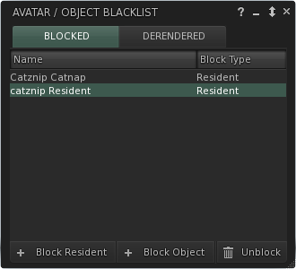

# Block List

This list shows avatars and objects that have been blocked. Blocked avatars are invisible except for their name tag. Blocked objects remain visible (see Object Blacklist).

## Avatars

There are several ways to block an avatar.

* Right click on any on in world avatar, from the context menu, manage > Block.
* Hover mouse over avatar and then click the (i) or left click on name in chat to open the avatar inspector, pick block from the fold out menu.
* Right click on any avatar on the nearby people list, friends list, group chat participants,
* From the fold out menu on the avatar's profile.
* \+ Block Resident on the Avatar / Object Blacklist floater and searching for the avatar name.

## Objects

Right click on any on in world object, from the context menu, manage File:MenuManageObject.png

* Block (mute) : Blocks all chat and message output from this specific object. Will be listed on the 'Blocked' tab.
* \+ Block Object on the Avatar / Object Blacklist floater and entering a name. This will block output from ALL objects with the same name.

## Notes

Derending an object will not block it at the same time, to do this, block the object and then derender it (see Object Blacklist).
