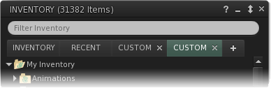

# Inventory Enhancements

## File based operations

### Cut & Paste

Linden Lab added Cut & Paste operations to the inventory floater and for some reason made them work in the style of a text editor. Cut objects would vanish and reappear when pasted. Sequential cut operations results in inventory items moving to the trash.

Inventory Cut & Paste in Catznip works the way you would expect from file manager. Cut items are marked and moved on Paste. Sequential Cut operations changes the selection. No inventory is ever moved to the trash.

## RLVa SharedWear

Historically there had been a need to rename items or folders in your #RLV Folder so they contained an attachment point name, [SharedWear](shared_wear.md) removed the need for this entirely and included in all RLVa viewers.

## Interface Changes

### Inventory Tabs

Clicking the [\+] button at the top of the inventory floater opens a new tab containing an independent inventory view. Each inventory view can have it's own filter and keyword search applied.

