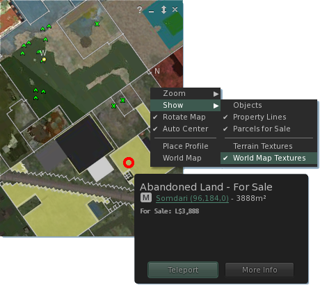

# Mini Map Parcels

## Context menu options

* Zoom > : Select from 3 preset zoom ranges. Scroll mousewheel to zoom manually.
* Show >
  * Objects : Show block outlines for objects overladed on the mini map.
  * Property Lines : Show outlines for parcel boundaries.
  * Parcels for Sale : Parcels for sale are overladed in yellow.
  * Terrain Textures & World Map Textures : Select if the map back drop is generated based on the Terrain or loaded from the world map.
* Place Profile : Open the parcels place profile floater.
* World Map : Open the world map to the selected location.

## Parcel Inspectors

Hovering the mouse over a parcel on the Mini Map or World Map and clicking the inspector tip opens the parcel inspector. Inspectors show the parcel name & description and (if) price for sale. File:InspectorLocation.png

## Avatar Profile Selection

Right clicking on avatar markers on the Mini Map provides the option to open their profile in the context menu. Tightly clustered markers will give the option to select which avatar's profile is desired.

This feature has been picked up by several TPV's.
