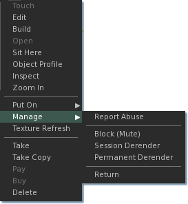
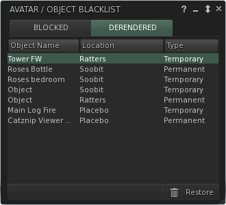

# Derender Objects

Right click on any on in world object, from the context menu, manage...

* Block (mute) : Blocks all chat and message output from this specific object. Will be listed on the 'Blocked' tab.
* Session Derender : Remove the object from view for this session only (until you relog).
* Permanent Derender : Remove the object from view for this session and all future ones.

Select an object from the 'Derendered' tab of the 'Avatar / Object Blacklist' floater and press the trash can icon marked Restore to immediately reload this object and return it to view.

You can access the Object / Avavtar Blacklist floater from the top menu > communicate > Blocked.  

Notes
You can not derender an avatar or avatar attachment, see the Block List.

Derendering an object that has an avatar sitting on it will cause both the object and avatar to vanish. The avatar will reappear the moment they stand up.

Derending an object will not block it at the same time, to do this, block the object and then derender it.
