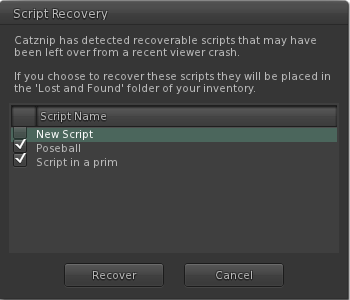

# Script Recovery

Ever crash while editing a script?

All open scripts are auto saved to your computer while you work on them so if you do crash, you will have the opportunity to recover your work.

Pick the scripts you wish to save and press Recover. Pressing Cancel removes any saved scripts from your computer and closes the dialog.

Recovered scripts are placed in your inventory Lost & Found folder.

This feature has been picked up by several TPV's.
