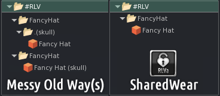

# Shared Wear

SharedWear represents one of the most obvious end user differences between RLVa and RLV and is enabled by default in all current RLVa Viewers.

**Note : Viewer 1 TPVs (Phoenix & Singularity) have SharedWear disabled by default. If wish to enable or have problems and wish to revert the original RLVa behavior, check or uncheck the top menu RLVa > Debug > Enable Shared Wear.**

## What is SharedWear?

The primary purpose of the #RLV Folder is to allow scripts to attach objects to your avatar without requiring you to manually locate and wear the item yourself.

Historically, the #RLV Folder has suffered a technical limitation. The viewer simply did not know where objects were to be attached. As a work around you have always been required to place objects in attachment point named sub folders. Historically RLVa would attempt to simplify this process by making the folders automatically the first time an item was worn. A work around the work around so to speak.

SharedWear is an RLVa feature that corrects the original problem. You simply no longer need attachment point named folders cluttering up your #RLV folder or item names. Any existing attachment point references will still be honored so nothing breaks.

RLVa doesn’t automatically make attachment point folders as they are no longer required.
