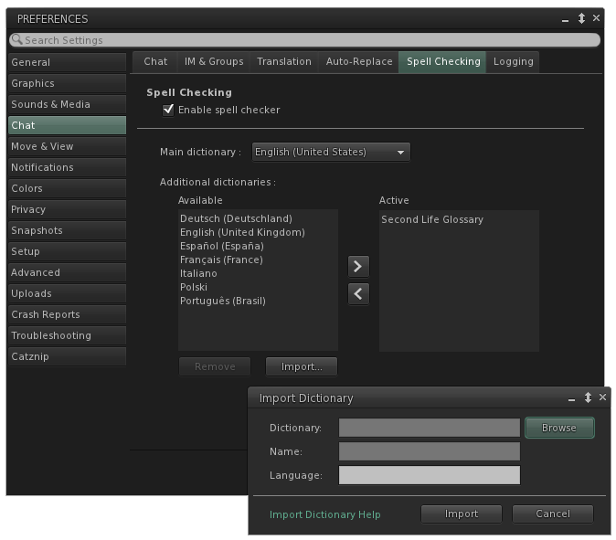

# Spell Checker

**This feature is now included as part of the official Linden Lab client.**

The Catznip Spell Checker highlights misspelt words as you type throughout the viewer, right clicking on an underlined word presents a selection of possible replacements, option to add to dictionary and to ignore all future occurrences.

## Installing Dictionaries

To install a dictionary for a language that doesn't ship with the viewer by default:

* Download the desired language from <http://extensions.services.openoffice.org/dictionary>
* Unzip it (if the file ends with .oxt you'll need to rename it to .zip first before you can unpack it)
* Click "Browse" on the spell checker "Import Dictionary" floater and navigate to the folder you unzipped the dictionary to
* Select the Dictionaries.xcu file as the file to open
* Type a friendly name for the dictionary in the "Language" textbox (i.e. French, German, Dutch, ...)
* Click "Import" to actually import the dictionary

## Notes

If the Dictionaries.xcu file does not exist in the unzipped folder, or if you're trying to import a dictionary from elsewhere, you'll need to manually select the .dic file to import: for most dictionaries it will start with an abbreviation of the language (i.e. fr for French, de for German, nl for Dutch, ...).

If you see multiple .dic files, try to import the simplest name first (i.e. a filename that does not contain things like "hyph" or "thes").
