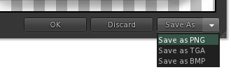

# Usability Enhancements

The bulk of work on Catznip tends to fall under the heading of Usability Enhancements, this encompasses everything from minor contextual changes to advanced features who's simplicity may undermine the amount of work that went into making it all work. Don't be surprised if many of the additions and changes aren't documented here.

## Asset Previews

### Texture Preview 'Save As...'

Texture preview 'Save as' button is now a fly out and remembers the last used format.

## Chiclets

Chiclets are the small row of icons at the top / bottom right of your screen that show instant message and group chat sessions, object menus and inventory offers, etc.

Catznip allows you to rearrange your IM tabs by dragging them, this now now affects the chicklet order as well. 

## Land and Mapping

### Parcel Inspector

Hovering the mouse over a parcel on the Mini Map or World Map and clicking the inspector tip opens the parcel inspector. Inspectors show the parcel name & description and (if) price for sale.

## Objects & Attachments

### Detach Folder

Right clicking on a worn attachment provides the option to detach that item and additionally to 'detach folder'; This will remove the attachment and all other worn items (attachments & clothing) contained in the same folder. For example to detach a pair of shoes, alpha and boot base with a single click on your avatar.

### Texture Refresh

Right clicking on any object or avatar attachment and selecting Texture Refresh from the context menu causes all textures and sculpt maps for the target object to be dropped and re-fetched. This can help should textures or sculpts fail to load completely.

--8<-- "includes/abbreviations.md"
