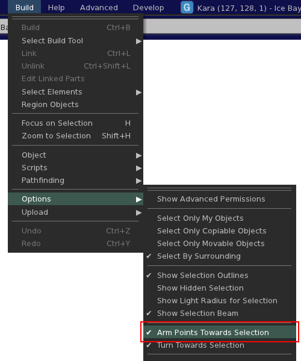

# Stop moving your arm when you right-click things

If you want to stop your arm from flailing about whenever you right-click on something, simply uncheck the following menu item:

<figure markdown>
  <figcaption>Build » Options » Arm Points Towards Selection</figcaption>
  { loading=lazy }
</figure>

Contributed by: Kitty Barnett
