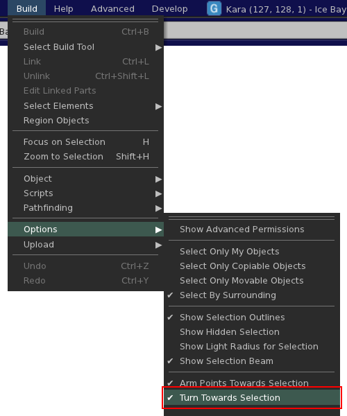

# Stop turning when you right-click something

If you want to stop your avatar from turning towards the point you're right-clicking on, simply uncheck the following menu item:

<figure markdown>
  <figcaption>Build » Options » Turn Towards Selection</figcaption>
  { loading=lazy }
</figure>

Contributed by: Kitty Barnett
