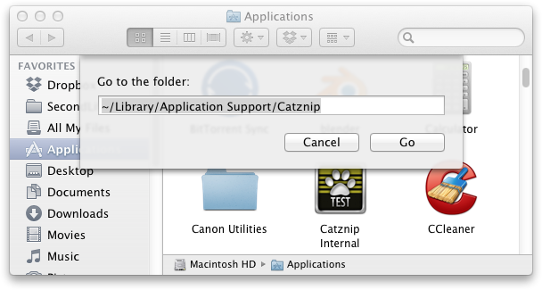
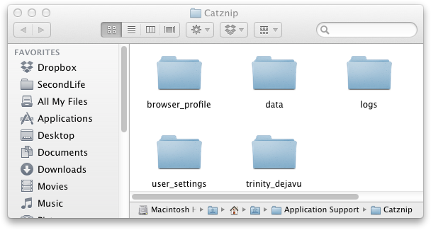

# Mac Clean Install

## Remove settings

Open Finder, from the top menu Go > Go to Folder and enter ~/Library/Application Support/Catznip

If you wish to delete all chat logs as well as removing the settings, drag ALL folders in the right pane to the trash.

If you do not wish to delete all chat logs, in the right pane, delete the user_settings, logs and browser_profile folders.
Enter each of the user named folders one by one (trinity_dejavu in the screenshot) and delete ONLY the browser_profile folder and all XML files. It may help to sort the folder view by type.

## Manually Clear the Cache

Open Finder, from the top menu Go > Go to Folder and enter ~/Library/Caches
Drag the Catznip folder to the trash.

## Remove and Reinstall

Open Applications and drag Catznip to the Trash.
Download the Latest Release and install as normal.
