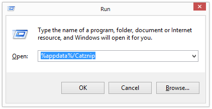
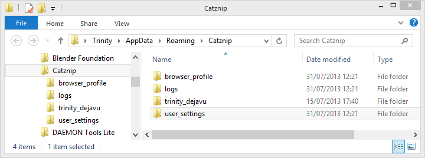
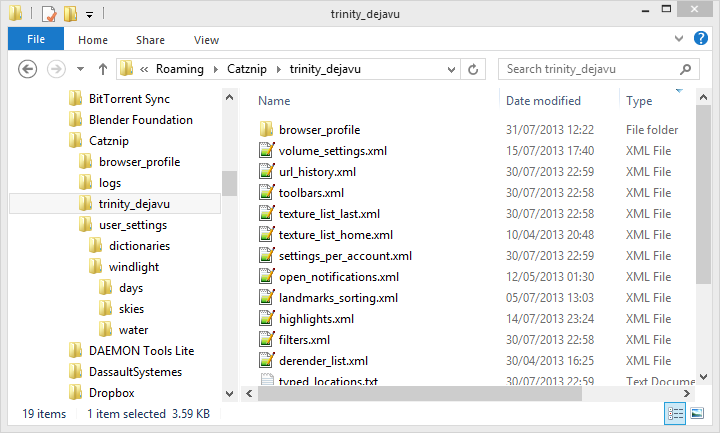
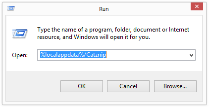
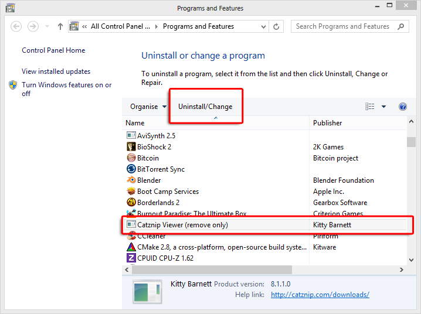

# Windows Clean Install

!!! note "Note : Any icons show in Windows Explorer may not match those on your computer. Images are for guidance only, please read the instructions carefully."

## Remove settings
Windows Vista, 7, 8 and 10 : Press the Windows Key + R and enter %appdata%/Catznip

Yes, it's ok to delete my chat logs..
If you wish to delete all chat logs as well as removing the settings, delete ALL folders in the right pane.

No! Don't delete my chat logs..
If you do not wish to delete all chat logs, in the right pane, delete the user_settings, logs and browser_profile folders.
Enter each of the user named folders one by one (trinity_dejavu in the following screenshot) and delete ONLY the browser_profile folder and all XML files. It may help to sort the folder view by type.

## Manually Clear the Cache

If you have opted to place the cache in a custom location, navigate to that location and remove ALL files. If not ...

Windows Vista, 7, 8 and 10 : Press the Windows Key + R and enter %localappdata%/Catznip

In the folder that opens up, right pane, select any file, press CTRL + A to select all and then SHIFT + DELETE. This will remove all of the cache files. It may take several minutes.

## Remove and Reinstall

Press Windows Key + R and enter control appwiz.cpl (This works on all versions of Windows).
Add Remove Programs.png

This will open Add/Remove Programs. Select Catznip from the list and uninstall as normal.

Download the Latest Release and install as normal.
