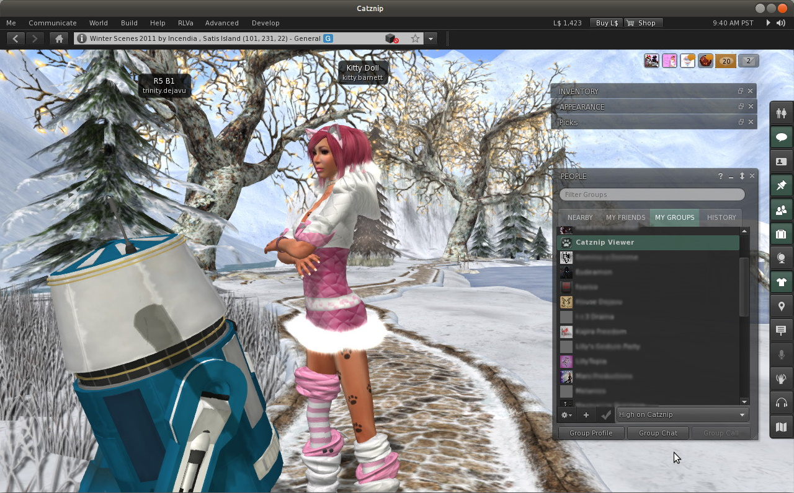

# Catznip R3 & R4

After much screaming, arguments, thinly veiled threats and finally tricking the Kitty while sleep deprived, we have finally settled on a numbering scheme for Catznip. R for release and then a number incrementally higher then the previous (I kid you not). So anyway, to celebrate we have not one but two releases side by side. Essentially cleaning up the 3.2.0 Beta we released recently, adding couple of new features and a slew of fixes.

!!! note "R3 and R4 are functionally identical in all regards with the exception that R4 includes the first round of OpenGL fixes from Linden Lab. R3 is provided as a fall back for those who have problems. R4 should be noticeably faster."

The Group floater now has a drop down menu allowing you to quickly select your active title for the current group, including the option to have a group active with no title displayed.

Almost all floating panels can now be ‘rolled up’ to just show the title bar, nice quick way to clean up the window clutter. Simple, but very effective.

Last but not least, a couple of additions which come as a direct result of user feedback here and on the SLU forums.

You can now open the picks floater from the ‘Me’ menu and by right clicking on your avatar. Seems the Lab neglected to add an obvious way to open the picks floater and creating a pick via a landmark was convoluted at best (See WEB-4303). Thanks Inhandra.

After some debate a wear option for inventory folders has been added and you can now set yourself Away or Busy a bit quicker on the ‘Me’ menu. Thanks Isara.

## New features

* added : “CloseChatOnEmptyReturn” and “CloseIMOnEmptyReturn” setting to close the floater containing the chat bar when committing an empty line
* added : an active group title drop-down to the group sidepanel tab
  * the “” entry will keep the group active, but hide the group title from your nametag
* added : “collapse” button to the floater top right controls (between “minimize” and “close”)
  * collapses the floater in-place rather than moving it to a different part of the screen and changing the width of the title bar
* added : “Wear on Current Outfit” option to the inventory category context menu
  * (replace) wears all items in the folder similarly to selecting all items and right-click “Wear”

## Changes

* added : “ChatTimestampSeconds” setting to show seconds in chat timestamps (for nearby chat and instant messages)
* added : “Picks” options to the main “Me” and avatar context menus
* added : “Expiration” and “Clear History” options to the recent people history gear menu
* changed : remove the default, starlight and stardust skins from the installation folder
* changed : pulled “Set Away” and “Set Busy” out of their submenu into the main “Me” menu

## Bugfixes (Catznip)

* fixed : attaching the nearby chat floater while the chat history is hidden reshapes the nearby chat floater to the wrong size
* fixed : attaching the nearby chat floater doesn’t always properly resize the chat bar
* fixed : crash when returning to the login screen (i.e. unsuccessful logon)
* fixed : Ctrl-T opens the toolbar configuration floater rather than the conversations floater
* fixed : “Manage > Kick” is visible on the avatar context menus even when the estate right isn’t granted

## Bugfixes (second Life)

* fixed : combo box separators aren’t visible (and wouldn’t fill the width of the combobox)
* fixed : various crashes due to the notification screen channel being destroyed before various notification are closed
  * i.e. offer 4 inventory items, open IM on the recipient, click “Show” on one of them and then shut down the viewer -> crash
* fixed : “double-click attachment” and “double-click wearable” add vs replace doesn’t work
  * value for the setting was reversed

## RLVa

* fixed : “Copy” submenu on the avatar context menus should be disabled when @shownames restricted
* fixed : “Teleport” option on the avatar context menus should be disabled when @shownames restricted
* fixed : clicking chat toasts opens the speaking resident’s profile when @shownames restricted

--8<-- "includes/abbreviations.md"
