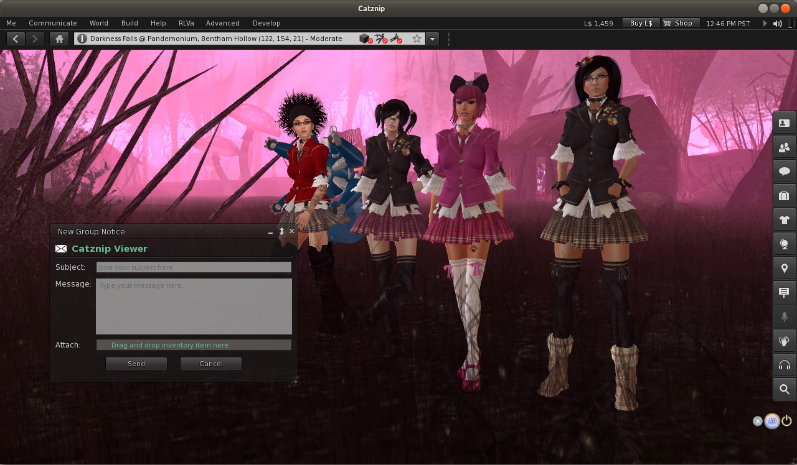

# Catznip R6

(Imported from MediaWiki - layout may be broken)

This is the maintenance release we were trying for last time and is strongly recommended, kitty did try and sneak in a few new features while she bashed away at the bugs but I stopped her! Not having any of that nonsense I said .. bad kitty.

That all said a brand new floater to send group messages appeared out of nowhere, just right click on a group in ‘My Groups’ and away you go. Incoming group messages got some love and are now just a bit more readable and they sort correctly, oh, and we jammed in a ton of windlight presets from a variety of sources (sorted and cleaned them up too).

Of the numerous bugs ironed out in this release, the delay when you right click something, or when you want to edit has been blasted to tiny pieces, as has the rather nasty one involving our spell-checker and multi-line chat (sorry about that). Thanks to everyone who contributed on the Issue Tracker and passed on feedback.

## Highlights
* Brand new interface to creating a group notice.
* Incoming group notices improved.
* Smoother experience editing objects in world.
* More responsive friends list.
* A huge stack of windlight presets, all cleaned up, nicely sorted with attribution where possible.

## Chat Enhancements
* changed : typing an (unhandled) printable character anywhere in the nearby chat or IM. floater will automatically set *focus to the chat editor.
* fixed : CATZ-10 Typing in the multi-line chat bar freezes the viewer.
* fixed : conversations floater opens when switching from single-line to multi-line while the nearby chat floater is torn off.

## Group Enhancements
* added : “Create Notice” and “View Notices” to the group context menu.
* added : “Create Notice” floater.
* changed : reworked the layout of the group notice toast.
	* split “notice sender/group” into two lines with clickable SLurls each.
	* number of visible lines from 7 to 10.
	* font size of the sent date from normal to small.
* fixed : group icon and name don’t load on a stored group notification after leaving the group.
* fixed : group notice toasts can overlap the bottom toolbar/bottom chiclets.
* fixed : group notices received while online don’t have a received timestamp.

## User Interface
* added : Windlight Presets from multiple sources
* fixed : don’t show an avatar or object inspector button if a (context) menu is open.
* fixed : hovering over a name in the friends list won’t show a tooltip with the username
* fixed : CATZ-14 Posting a snapshot to the profile feed fails
* fixed : CATZ-4 Right-clicking a linkset freezes the viewer for a split second
* fixed : CATZ-5 Editing a linkset freezes the viewer for a (few) second(s)
* fixed : CATZ-6 Nearby avatars show the “is below” chevron when above 1020m
* fixed : having the syswell floater open results in higher ‘Find Widgets’ time
* fixed : scrolling through the friends list with the arrow keys spikes ‘Find Widgets’
* fixed : persistent notifications in the syswell aren’t sorted by date.
* changed : clamp the maximum value of texture repeats to 256 (up from 100)
