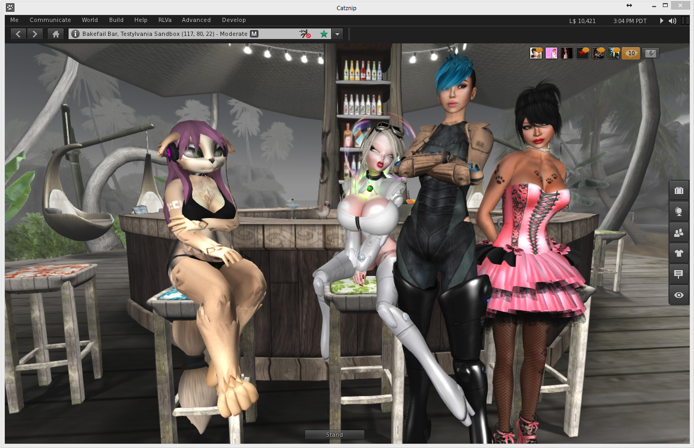

# Catznip R8

This release brings initial support from Linden Lab (LL) for server side appearance (SSA, formerly known as SSB, I know, right..), Havok integration adds the long awaited ability to upload mesh objects and the full set of pathfinding features. We've added a couple more little usability features that we know you'll love and some minor updates to RLVa.

We've been holding back on this release wanting to make sure we provided a good experience with SSA when it goes live, LL are working up to the wire and we didn't feel entirely comfortable with the state of the project. As it stands this release provides only initial support for SSA, There will be more from LL and that will be in Catznip R9.

All in all this delay has really paid dividends; we've been able to polish up the 'R7 feature flood' and worked in a lot of crash and bug fixes, including a few last minute ones that came up in our beta testing. Will be looking to expand the beta test team for the next release, but as always, quality over quantity.

Personally, this feels like one of the most polished releases we have ever done and it certainly flies.

## Catznip Features

* added : "Per user" option to the "Show friends permissions" in the friends gear menu to always show non-default permissions
* added : "Edit Hover" button functionality to show the shape editor, scrolled down to the "Hover" wearable param
* added : additional toolbar at the top of the world view
* changed : allow toolbar buttons to be aligned left, center or right

* added : "Close All Folders" button to the inventory outfits view toolbar
* changed : highlight the currently worn outfit folder in bold
* changed : rearrange the avatar inspector to add extra lines to the profile description
  * one extra line added by default through layout changes
  * two extra lines are added by expanding the textbox to fill the volume slider space if voice is disabled
* changed : report more useful information about memory state in case of a crash
* changed : allow multiple crashes to be selected in the "Crash reporting" preferences panel

## Catznip bug fixes

* fixed : attempting to recover a script named "New Script" on a non-English language results in an endless failed upload loop
* fixed : object and property line overlays are shown as red on the mini-map
* fixed : updated DbHelp.dll to Windows 8 SDK version
* fixed : "Open in / New Tab" on the inventory item context menu doesn't work in the "Outfits" panel
* fixed : Help / About floater only updates the first time it is opened
* fixed : cancelling out of the Advanced / Shortcuts / Snapshot to Disk file picker crashes the viewer
* fixed : clicking the up/down layer reordering buttons doesn't work on SSB-regions
* fixed : "Save As" button on the texture preview floater extends the floater border
* fixed : "Restore to Last Position" is visible on the inventory context menu for worn attachments
* fixed : can't drag/drop library inventory items to world, or to agent inventory
* fixed : IM conversations can no longer be drag-rearranged
* fixed : notices won't load if the group floater was opened as a result of the "Show Notices" option from the group context menu
* fixed : crash in LLScriptEdContainer::onBackupTimer()
* fixed : crash in LLPanelPreferenceCrashReports::onCopySelection()
* fixed : clicking  "Play Inworld" or "Play Locally" on the animation floater doesn't change the label to "Stop"

## Second Life bug fixes

* fixed : saving a notecard in object inventory shows an empty notecard after the save completes
* fixed : object context menu flickers for objects participating in pathfinding
* fixed : "Detach" on a selection of multiple attachments only detaches one of the selected attachments
* fixed : llerrs crash in LLMeshLODResponder::completedRaw() when server sends 409 status
* fixed : "Send IM" and "Offer Teleport" context menu options don't work in the group floater
* fixed : some group members are listed more than once in the group member list
* fixed : scroll list columns can't be resized
  * additionally, attempting to resize a column and then changing the floater size caused the columns to disappear or be layed out randomly
  * double-click fitting was also broken
* fixed : inventory folders don't open to show filtered items when searching
* fixed : editing a wearable and clicking the "Save" button takes off the wearable
* fixed : crash in LLMeshRepoThread::headerReceived() attempting to erase an invalid iterator
* fixed : viewer hangs when copying the contents of an object to inventory while typing
* changed : updated gpu_table.txt (from Firestorm)
* changed : updated LSL constant, function tooltips and keywords (from Firestorm)

--8<-- "includes/abbreviations.md"
