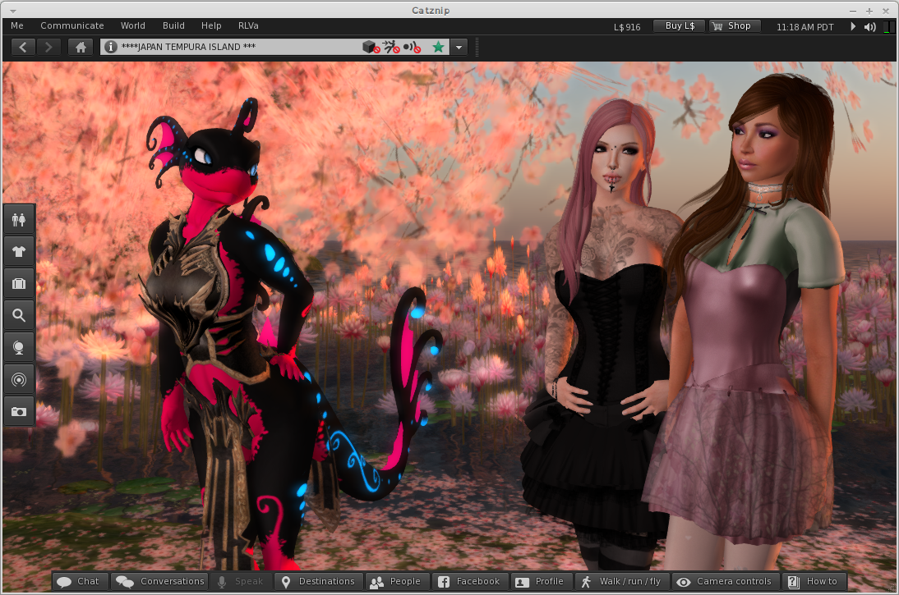

# Catznip R9

This release has certainly been a long time coming and is our biggest single release to date, it will also be the last mega update as we move to a new shorter faster release cycle.

The main new feature in R9.0 is the Chat which has been rebuilt from scratch. LL added CHUI, we spent a huge amount of time trying to make it nice only to find the performance with it enabled was unacceptable. As the old chat was removed at the same time we had no choice but to start over. Chat has been redesigned from scratch and includes many CHUI inspired features.

Inventory searching has been made lightning fast, textures now have a preview tool-tip, script editor got a lot of love with a tighter UI, as you type highlighting for text searches, more work was done overhauling the UI and a new in place updater was added.

From Linden Lab this release adds CHUI (even though we don't expose it), facebook support, fitted mesh, materials, ribbon particles and request teleports amongst others things.

In answer to huge gap between R8 and this release we shelved a lot of things we were working on and started our open beta program. A huge thank you to everyone who got involved, reported bugs and issues, helped find bugs and crashes, made suggestions. This has been so successful that it will form the basis of all releases going forward.

Future releases will be smaller and incremental with more public testing. We hope this will allow up to keep up with Linden Lab, continue to deliver unique new features and make Catznip the most stable Second Life viewer. There is a small mountain of work we did that just isn't polished enough to get in this time, expect to see a new things coming through thick and fast as we go forward.

## Avatar picker

* added : ability to filter the friends tab in the avatar picker
* changed : [CATZ-116] Add usernames to avatar picker's Friends tab

## Build Tools

* added : drag-and-drop textures directly onto a prim face using local textures as the backing store (Windows only)
* added : drag-and-drop uploading of textures (Windows only)
* added : "Selection Options" floater to the build floater grouping all selection related viewer options
* added : "World / Options / Select Only Copyable Objects" option to the main viewer menu as well
* added : option to prevent turning towards a newly selected object
  * controlled by 'RotateAtSelection'
* added : option to prevent the avatar's arm from pointing at a newly selected object
  * controlled by 'SendPointAt'
* added : copy/paste of the different types of texture parameters
  * Three possible scenarios (always on a single object):
    * (1) copy all texture faces (which may or may not be identical) => pastes the texture data on matching selected faces
    * (2) copy one texture face => pastes the texture data on all selected faces
    * (3) copy several texture faces => pastes the texture data on matching selected faces
* added : pipette for the different types of texture parameters

## Chat

* internal : restoration of IM/P2P/group chiclets + IM syswell chiclet + IM conversations floater
  * this took all of the time :(
* added : "Chat sounds" floater to configure the different UI chat/offer related sounds
* added : "&lt;name&gt; is typing..." tentative message is shown in the chat history while the other party is typing
* added : show a context menu when right-clicking a conversation tab
* added : persist unread IMs to disk so they can be restored in case of a crash or log-off
* added : inplace search control for text editors
  * current selection is used as the search 'phrase' when opening the inplace editor
* added : [CATZ-102] Ability to scroll the conversations floater tabs with the mouse wheel
* added : "Request Teleport" to the context menu of a resident link in chat
* added : "Chat Bar" option to the IM session chat bar and chat history context menus to toggle between expandable and single-line text editors
* added : split the "Teleport" option on the chiclet P2P context menu into "Offer Teleport" and "Request Teleport" and added an option for "Pay" as well
* added : option to control whether chat or group notice toasts will show above/below unfocused floaters (such as the mini-map)
  * main setting is "NotificationToastFrontmost"
  * "NotificationToastFrontmostFocus" further controls whether new notification toasts will appear above/below floaters that currently have focus (such as the conversations floater)
* added : "Conversations" button to the toolbar commands
  * "Nearby Chat" will highlight when the nearby char floater is visible (whether docked or undocked) and toggle it when pressed
  * "Conversations" will highlight when the conversations floater is visible and toggle it when pressed
  * changed : 'ChicletBarAlignment' can be toggled at runtime and no longer requires a restart** changed : behavior of arrow keys when focus is on the conversations container, nearby chat or IM conversation
    * CHUI default: arrow keys never move unless "ArrowKeysAlwaysMove" is set to TRUE
    * additionally: arrow keys move the avatar if focus is on a conversation floater and no text has been entered (legacy behavior)
* added : "control panel" for P2P IM sessions which currently shows an avatar's profile picture and an excerpt of their profile information
* added : configurable sounds for teleport and inventory offers, script question dialogs, group notices and region restart events
* added : toolbar buttons for group conversations    -&gt; "View Information", "Show Chat History" and "View Notices"
* added : "History Search", "View Profile", "Offer/Request Teleport", "Chat History" and "Pay" toolbar buttons to the IM session floater

## Inventory Enhancements

* added : significant speed improvements when filtering inventory
* added : 'Open in Inventory' checkbox to the "Buy Contents" floater + UI layout cleanup
* added : texture tooltip for inventory items
* added : "Copy Outfit List to Clipboard" is now available when right-clicking any outfit folders in your inventory
* added : option to clear the current inventory filter rather than create a new inventory floater when the shown item is currently filtered
  * controlled by 'InventoryShowItemClearsFilter' (default: clear filter)
* changed : always show the "Received Items" folder if the inventory's panel contents are filtered (with a non-default filter)
* changed : don't hide empty system folders by default ('DebugHideEmptySystemFolders' to FALSE)

## Miscellaneous

* added : option to control how offered inventory is handled while marked as 'Do not Disturb'
  * Pop up a chiclet as normal (default)
  * Auto-accept the offer
  * Auto-decline the offer
* added : double-clicking on the title bar of a floater will collapse it
* added : extra dictionaries for the spell checker (German, French, Italian and Polish)
* added : Xanthe's Windlight presets.</commit>
* changed : cycle between (unacknowledged) inventory offers or script floaters
  * e.g. pay a gacha machine 5 times / buy 3 items from script vendors in a row
  * every time you press "Keep" the next inventory offer will automatically pop-up saving you an extra click and ensuring you'll never miss one
* changed : restore the legacy behavior of showing a texture preview at full resolution (if possible)
  * if (one of) the texture preview's dimensions exceeds the window size the preview should be resized proportionally rather than "best fit"<
* changed : normalized display of time in the viewers to SLT (PDT/PST)
  * offline IMs show SLT rather than local time
  * covenant modify timestamp shown as SLT rather than local time
  * group notice toasts shown as SLT rather than UTC time
  * group notice times in the group floater shown as SLT rather than local time
  * timezone indicator was added to help point out the difference to new Catznip users:
    * Before: Saved Mon Aug 19 14:50:10 2013
    * After : Saved Mon Aug 19 2013 05:50:10 PDT
* changed : filter duplicate landmarks on the world map landmarks combo box + provide the option to only show self-created landmarks
  * controllable through the 'WorldMapFilterSelfLandmarks' debug setting

## Landmarks

* added : "Landmark This Place" shows the new place floater to edit the name and/or description

## People panel

* added : "Highlight Hidden Groups" option to the view/sort menu for the People/Groups panel
* added : "Online friends / Total friends" to the online friends accordion tab title

## Move / View

* changed : compacted the camera and movement floaters
* added : slider / debug setting for the camera/move floater transparency

## Notecards / Scripts / Text editors

* added : recovery support for unsaved notecards (embedded items are not preserved)
* added : texture tooltips for embedded notecard items
* added : use the current selection as the default search string
* added : highlighting of occurrences in the target editor when using the Search/Replace floater
* added : keyboard shortcuts to the script editor menu
  * F1 opens the LSL reference
  * Shift+F1 opens keyboard help
  * Ctrl+G opens the "Go to line" floater
* changed : "Go to Line" and clicking on a script error will ensure (at least) three lines above/below the target line are visible
* changed : case-insensitive search is enabled by default (for notecards, scripts and text editors)

## Major preferences overhaul (WIP)

* added : provide tooltips to settings-driven controls by using the setting's description field
* changed : complete chat preferences overhaul into multiple panels
* changed : integrated the "Translation" floater into the Chat preferences panel + updated layout + updated translations
* changed : integrated the "Auto Replace" floater into the Chat preferences panel + updated layout + updated translations
* changed : integrated the "Spell Checking" floater into the Chat preferences panel + updated layout + updated translations
* changed : "Sound and Media" preferences panel was overhauled
* changed : "(requires restart)" is now consistent

## Preferences / Troubleshooting

* added : "Troubleshooting" tab to the preferences floater
  * Catznip Group Chat : opens the support group (conversation or group profile to join if not a member)
  * Reset Avatar       : force-clears the Current Outfits folder and wears the default avatar outfit on the next relog
  * Clear Viewer Settings : clears the non-personal viewer settings on the next viewer restart (preferences, menu options, debug settings, ...)
  * Clear Personal Settings : clears person (per-account) viewer settings on the next relog (toolbar layout, saved notifications, derender list, ...)
  * Clear Cache : clears viewer cache on the next viewer restart
* added : Option to use raw joystick deltas
  * debug setting 'JoystickRawDeltas' (enabled by default)
* changed : Tweaked XBox360 pad defaults into something semi-sane

## Profiles

* added : "Copy to clipboard" fly-out button to the main profile panel (options to copy full name, display name, user name, SLurl and UUID)
* added : translations for the profile floater and related profile panels
* changed : rearranged the profile action buttons (removed "Add Friend", added "Pay" and "View Web Profile" buttons and replaced the overflow button with a gear menu button)

## UI overhaul

* added : new chiclet icons for unread IM overlay and objects/script dialogs
* added : new "Teleport" and "Pay" icons added to all panels/floaters with a 'Teleport' toolbar option
* added : new "Play" icons (32x32)
* added : updated 20px default person and group icons
* added : clickable social media icons to the about floater
* changed : much improved region restart floater with added landmarks drop-down
* changed : integrated web browser showing stop and refresh buttons
* changed : updated "avatar picker" floater
* changed : improved group invite panel/not-a-floater/why ...
* changed : "About" floater layout tweaks .. lalala :P
* changed : tightened up world map floater
* changed : itty bitty teeny weeny xui floater thingy
* changed : RLVa Strings floater UI
* changed : Updated toybox floater
* changed : Different icons for about land objects listing
* changed : Tidy choose group floater
* changed : Tidy inspect objects floater
* changed : Tidy LSL ref floater
* changed : Tidy web browser
* changed : Tightened up mesh upload floater
* changed : Tightened up script debug floater
* changed : Tidy buy object floater
* changed : New group notice title and fonts
* changed : Cleaned up notecard floater

## Updater

* added : "Check for Updates" menu item to the main Help menu to trigger a manual update check with user feedback
* added : floater to track the progress of the updater download
* changed : only apply the updater download bandwidth cap once the user has passed the login screen
* changed : don't prompt the user to launch the viewer after instalation

## Viewer

* added : multi-user drop down on the login screen
  * stored accounts can removed by clicking the little 'x'
* added : Catznip R9 release quote
  * "This release makes no sense what-so-ever." ~ Trinity Dejavu
* added : Branding for Catznip Homebrew
* added : Social media links to the Help menu
* added : __GL_THREADED_OPTIMIZATIONS For Linux Users.
* changed : only fetch the feature/GPU table if the file has actually changed
* changed : removed references to the 'Linux Client Beta' .. only 7 years late

## Minor changes

* changed : shorten the name of the Second Life grids
* changed : show the agent's current parcel name rather than the region name as a default message when offering a teleport
* changed : use a grid-specific home/last start screen
* changed : remember the last used tab in the Search floater
* changed : allow multi-selection on the mute and derender lists
* changed : remember the last-used sort order and sort direction of the mute and derender lists
* changed : selectively reverted LL changes to how/when user names (now referred to as account name) are displayed
* changed : don't show "Restore to Last Position" on object links
* changed : don't show "Share" on the context menu of system (or outfit) folders
* changed : updated German menu translations (Thanks Qetesh)
* changed : avatar picker range now matches people floater
* changed : Autoreplace list renamed to avoid confusion
* changed : removed the shortcut key for "Force Breakpoint" in the Debug / Force an Error menu

## Catznip bugfixes

* fixed : freeze when picking "Detach Folder" from the attachment context menu (or the Wearing panel)
* fixed : don't log raw notifications SLURLs to IM (fixes FriendOnlineOffline and PaymentReceived/Sent not logging in a human friendly way)
* fixed : persisted group notices no longer restore on the next log-on
* fixed : vertical tat container control's vertical scrolling is non-functional (among other issues)
* fixed : vertical tab container control doesn't scroll to show the current conversation if it's out of the visible scroll range
* fixed : cancelling the script recovery floater doesn't delete the .lslbackup files
* fixed : picking "Session/Permanent Derender" from the object context menu opens the derender list but doesn't select the newly added entry
* fixed : translations for the "Zoom" mini-map context submenu are missing
* fixed : &lt;Ctrl&gt;+&lt;Enter&gt; won't wear the selected item  (should behave the same as &lt;Ctrl&gt;-clicking the inventory item)
* fixed : "SLurl was received from an untrusted browser and has been blocked" when clicking "Teleport" on a web search result when 'PreInitSearch' is set to TRUE
* fixed : "Create (Group) Notice" floater isn't centered when opened
* fixed : "inventory" or "in-world" indicator is missing on the inventory item properties floater (moved to a suffix of the floater title
* fixed : the sale type combobox of the inventory item properties floater doesn't show the current sale type, or update the item's sale type when changed
* fixed : parcel text doesn't always expand to fit available space in the mini-location bar
* fixed : various translation fixes for the debug settings, script queue and gesture floaters
* fixed : "Add contact" results in "Cannot create inventory item" message
* fixed : "maturity_desired_textbox" textbox control is missing from the general preferences panel
* fixed : having the toast and chiclet bar alignment on opposite sides of the screen incorrectly reserves space for the dock control (toasts appear with a gap at the top of the screen)
* fixed : "Edit" on the inventory item context men for attachments shouldn't use a temporary selection if the build floater is active
* fixed : cannot search for usernames in the people panel when 'AgentLinkShowUsernames' is set to 'never'
* fixed : avatars at the maximum coarse update height are shown as being present at that height rather than showing as having an unknown position
* fixed : "Find Original" doesn't highlight items in the Inbox folder
* fixed : inventory items jump/flicker/radically change scroll position when creating a new inventory item
* fixed : "Cut" isn't shown on the inventory item context menu for inventory links
* fixed : "Paste" isn't shown as disabled when copying a "no copy" item onto the clipboard
* fixed : crash when resuming a download on start-up due to freed memory
* fixed : web content floater now has correct button icon for 'Stop'
* fixed : speculative fix for notifications/IMs (rarely) being saved as the agent's display name rather than their legacy/user name
* fixed : translations for me menu avatar status were missing
* fixed : [CATZ-58] "Typing" is visible in the nametag when bubble chat is enabled for as long as the chat is visible
* fixed : [CATZ-97] 'View Notices' menu item is active for group 'none'
* fixed : [CATZ-99] Export Auto-Replace list wants to Import instead
* fixed : [CATZ-104] Help / Report Bug Points to invalid URL
* fixed : [CATZ-121] Long display name overlaps the user name on the avatar inspector
* fixed : [CRASH-7] Crash in LLOutfitsView::setSelectedOutfitByUUID() when logging on with a newly created account

## Linden viewer bugfixes

* fixed : chat conversation navigation keys are backwards in CHUI
* fixed : Alt-Up/Down switches between IM sessions in CHUI-mode when the conversation floater is torn off rather than docked
* fixed : the conversations floater doesn't hide in CHUI when tearing off nearby chat if it's the only remaining conversation
* fixed : clicking the "Chat" toolbar button after logon shows both the nearby chat and conversations floater if the nearby chat floater was torn off at the previous logoff
* fixed : don't fetch the entire inventory upon login
* fixed : the Chat toolbar button doesn't toggle the visibility of nearby chat when it's the only remaining conversation and is torn off
* fixed : a lot of LLFloaterIMContainerView functions are unnecessarily called per-frame (refactored + optimized since a few are expensive no-ops)
* fixed : "Zoom In" on the IM conversation gear menu is always disabled
* fixed : Help / Keyword Help doesn't load the correct page when unicode characters are present in the script editor
* fixed : "Teleport completed from" nearby chat message on successful completion of a teleport is missing
* fixed : LLOfferInfo::forceResponse() forces a response on the wrong notification (causes lost inventory while marked as DnD)
* fixed : clicking on a separator on the side of a disabled menu item shouldn't dismiss the menu
* fixed : only show the "Block Particle Owner" context menu option when the user right-clicked on/through a particle
* fixed : friends list doesn't always initialize when opened for the first time
* fixed : dragging the volume slider doesn't unmute the corresponding setting (unless preferences were opened before logging into the viewer)
* fixed : muting world sounds doesn't disable the "Play gestures" checkbox on the volume pulldown panel
* fixed : toggling media or streaming audio have "Pref.updateMediaAutoPlayCheckbox" copy/pasted from preferences even though it doesn't apply (and doesn't work)
* fixed : minimum width/height for multi-floaters is calculated wrong
* fixed : "Missing String in strings.xml" appears in the log when opening the gestures floater
* fixed : viewer idles for a few seconds before shutting down after clicking the close button
* fixed : copy/pasting text with an ending line-break into a text editor control doesn't insert a line break segment
* fixed : don't fetch the entire inventory upon login (yet again)
* fixed : opening preferences before log on will instantiate and initialize LLConversationLog before we have account specific settings or file paths
* fixed : viewer clips mouse to its rectangle when switching into mouselook while it's not the active application
* fixed : potential crash in LLFloaterIMSession::removeTypingIndicator() by reusing an already deleted pointer
* fixed : don't send typing start packets to groups or conferences
* fixed : RenderResolutionDivisor is non-functional
* fixed : double-click teleport is initiated when left-clicking to give focus back to the viewer
  * viewer now remains in mouselook after "activating" the application
* fixed : the "Save logs" combo button has the same name as another control and isn't actually being disabled from code
* fixed : the "To &lt;recipient&gt;" label is still visible on the chat entry control when it has focus (reverses and actually fixes the root cause behind CHUI-958)
* fixed : searching for a (partial) region name that matches the agent's region shows no results
* fixed : accepting a teleport offer from a different region than it was received in will stall at the teleport screen
  * since we can't fix this, we'll visually cancel the notification instead after teleporting to a different region
* fixed : notification sound plays twice if you have both "new conversation" and "new IM" checked
* fixed : can't copy/paste a folder containing links
* fixed : can't click on a link if there's an active selection in the text editor
* fixed : logon / inventory fetching freezes due to avatar tracker updates and excessive calling card updates
* fixed : the 'IM_unblock_only_groups_friends' notification isn't shown when a non-friend IMs with 'VoiceCallsFriendsOnly' set to TRUE
* fixed : [BUG-4617] Renaming an inventory folder can result in a different folder being moved inside another folder
* fixed : [BUG-3527] Replacing a misspelling surrounded by line break segments results in only line breaks being inserted
* fixed : [CATZ-59] The search/replace floater has an unintuitive tab order
* fixed : [STORM-2029] If someone on your block/mute list initiates a group conversation you'll never see chat for that group during that logon session

## RLVa Updates and Fixes

* added : @tprequest=n|y and @accepttprequest:[uuid]=n|y
* added : Give to #RLV script-to-agent and agent-to-agent offers can contain subfolders
  * limited to 3 levels (e.g. #RLV/~FolderA/FolderB/FolderC)
  * The #RLV folder is auto-created if it doesn't currently exist
* added : RLVa German menu translations
* changed : show a limited context menu in the nearby people panel when @shownames restricted
  * "Offer/Request Teleport" (filtered)
  * "Zoom in"
  * Block/Unblock
* changed : llRegionSayTo messages are no longer subject to @recvchat or @recvemote
* changed : mark @adjustheight as deprecated since it's not supported by SSA
  * a wearable edit workaround would be clumsy, not work under all circumstances and could potentially cause asset corruption
* changed : RLVa debug is now develop. Much sexier.
* fixed : locked folder lookups don't properly refresh when an item is taken off (or worn)
* fixed : @getstatus and @getstatusall should specify an (optional) separator
  * added support for both @getstatustp;,=123 and @getstatus;,=123
* fixed : region name and global coordinates are shown on the About floater when @showloc restricted
* fixed : "Find Original" on the Wearing panel's context menu opens the default inventory floater when @showinv restricted
* fixed : RLVa floater button sizes with wide font.

--8<-- "includes/abbreviations.md"
