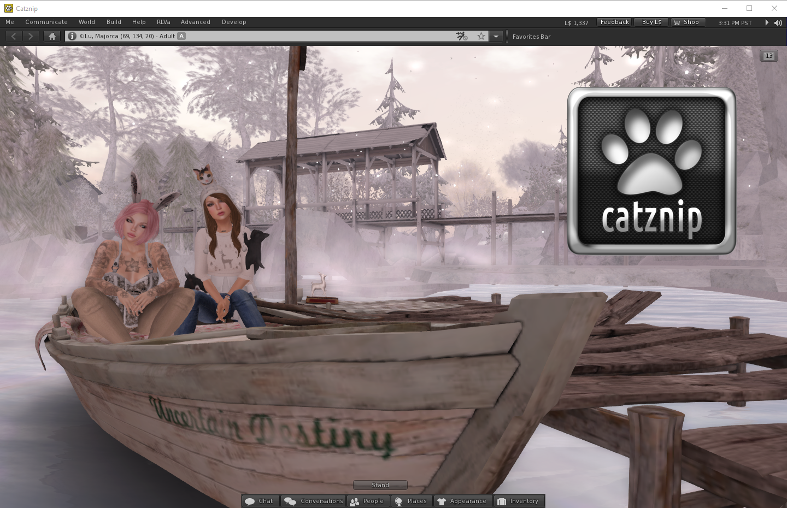

# Catznip R10

(Imported from MediaWiki - layout may be broken)

Catznip R10 is a long overdue update that brings the viewer right up to date with all the latest from Linden Lab and fixes several issues from R9.

A huge thank you to everyone who has stuck with us since the last release (20 months previous!), as those close to the project will know it has been a long and difficult time with altogether too many health issues. Things are finally heading back in the right direction :)

At this time we only have a Windows release, Linux will follow shortly.

Due to a lack of time and suitable hardware we are unable to build, test and debug an OS X version to the standard our users would expect from Catznip. At this point it seems unlikely that there will be future OS X versions of the viewer. Thanks to those who have offered remote access or to build the viewer on our behalf.

## R9 Fixes
* fixed : "Teleport" and "Show on Map" on the parcel information floater don't work until after the parcel information has loaded
* fixed : can't copy/paste a folder containing links
* fixed : "Unknown" is shown on the login screen when no credentials are present
* fixed : Web search isn't initialized on the next logon session if user closed the search floater with the legacy places search open
* fixed : Double-clicking a body part doesn't (replace) wear it
* fixed : "Show Group Chat" option on the group url context menu doesn't work
* fixed : Dragging the build floater to the edge of the screen makes dependent floaters on that side inaccessible
* fixed : A whole bunch of SSAv2/AIS appearance issues
* fixed : CATZ-201: OK button overlays 'Fog Distance' on 'Hardware Settings' floater
* fixed : CATZ-48: Texture Refresh shouldn't affect default textures
* fixed : CATZ-218: Texture refresh doesn't affect textures pending download
* fixed : CATZ-213: Edit Landmark buttons in Places sidepanel
* fixed : CATZ-94: Typo in chat preferences tab
* fixed : CATZ-210: Location input control's context menu is missing

## Viewer Fixes
* fixed : Closing 100+ notifications locks up the viewer
* fixed : Can't use "Ctrl-X" to cut an inventory selection consisting of a single worn item (context menu works fine)
* fixed : Toggling between condensed and expanded views of notifications isn't visibly smooth or attractive
* fixed : User-installed custom dictionaries no longer work

## Changes
* changed: Don't use the "first login on this install" login screen
* changed: Allow dragging of outfit folders into user (FT_NONE) folders within the My Outfits folder

## New features
* added : Notification filtering (by type and/or text) to the notification well floater
* added : (Re)added support for "Separate (Chat) Windows"
	* not currently accesible through UI - use the debug setting (IMUseSeparateFloater) to control the separate windows vs tabbed container functionality
* added : 'EnableGrabNonPhysical' setting to control grabbing of non-physical objects (off by default)
	* fixes the problem of accidentally hitting an object while holding down Ctrl/Ctrl-Shift
* added : "Ear at speaker position" option for voice chat
* added : teleport fade in/out transitions
* added : Show an old "Live Help"-style message when the user opens the support/beta group(s)
* added : "Show Debug Setting" SLapp command for support (syntax: secondlife:///app/setting/<setting>[/show])
* added : feedback floater to allow users to submit viewer feedback easily
* added : Clicking a group notice in the notifications floater will now toggle between the expanded and condensed views
* added : CATZ-164: Added "Show Web Browser" menu item to the bottom Advanced menu (homepage is customizable through the * added : 'BrowserHomePage' debug setting)
* added : CATZ-173: Name tag colour option for "friends" and "others" to the preferences 'Colors' panel
* added : CATZ-211: "Paste and teleport" functionality for the input location control

## RLVa Updates and Fixes
* added : Better handling of temporary attachments when checking attachment locks
* fixed : Reimplemented the @adjustheight command using LL's new hover functionality
* changed: More user-friendly and intuitive enable/disable toggling behaviour
