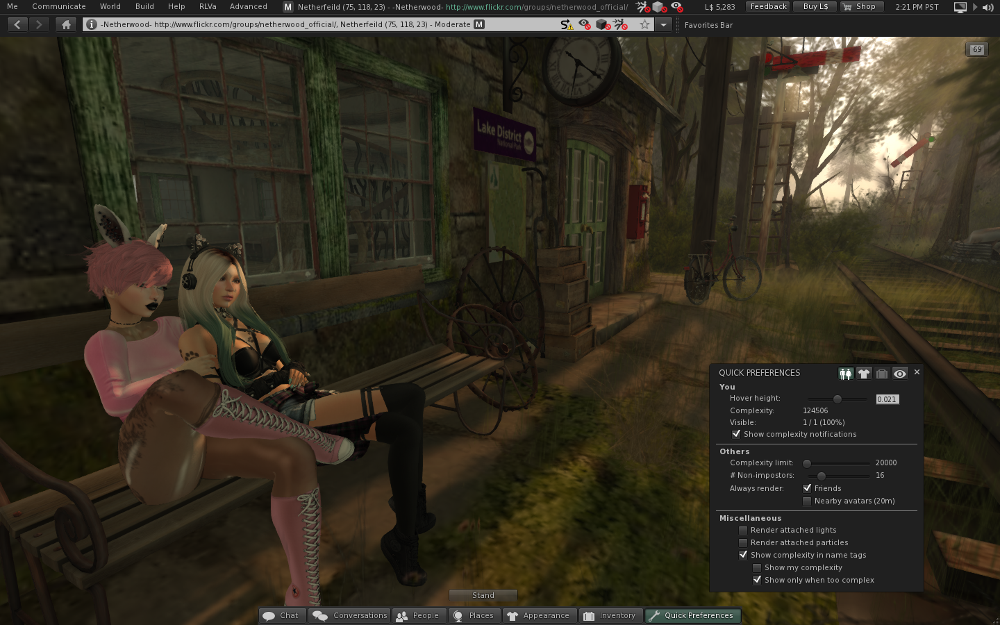

# Catznip R11

(Imported from MediaWiki - layout may be broken)

This release brings Catznip right up-to date with new LL features including Bento (new avatar bones), Jelly Dolls, Graphics presets, HTTP co-routines, LibVLC, OpenJPEG, voice improvements and a lot of bug fixes. We also have a new 'Quick preferences' floater providing access to local rendering, avatar complexity, wearing and windlight options. RLVa has seen more incremental updates and can now be enabled without needing to restart the client.

Important note : Linden Lab's Bento project (new avatar bones) is not backwards compatible with previous viewers and as such all previous versions will be blocked in the near future. Please update to R11 at your earliest convenience and get in touch to resolve any issues.

## New
* Quick Preferences panel - auto-added to everyone's bottom toolbar; please test and give feedback
* Quick Appearance - several options to deal with avatar complexity in a (hopefully) more intuitive and easy way
* Quick Wearing - fast access to worn items + list of complexity cost per item (WIP - context menu not complete yet)
* Quick WindLight - change WindLight presets easily
* CATZ-225: Split long chat/IM messages into multiple chunks
* OpenJPEG Updated to 1.5.2 (from 1.4)
* CATZ-266: Change the avatar hover height from the quick appearance panel
* CATZ-264: Added version number to title bar
* CATZ-225: Split long chat/IM messages into multiple chunks

## Fixed
* [FIXED] CATZ-163: Changing Windows Audio Output Device requires a relog to work
* [FIXED] CATZ-207: Feedback floater doesn't close after submitting feedback
* [FIXED] CATZ-244: Edit Hover button doesn't work
* [FIXED] CATZ-256: Avatar profile pictures on the IM control panel are always blurry
* [FIXED] CATZ-241: Next owner checkboxes are inaccessible on the inventory item properties floater (localization bug)
* [FIXED] CATZ-248: Help / About is missing the BUILD_* substitutions
* [FIXED] CATZ-267: Offers/notifications from/to avatars with the Resident last names log to the wrong file
* [FIXED] Avatars with large inventories remain a cloud for a long time after clearing cache and relogging
* [FIXED] CATZ-178: Ability to switch between IM tabs with keyboard
* [FIXED] CATZ-238: Picking an object tint color is unintuitive when the current colour is white/black
* [FIXED] CATZ-20: Mini Map context menu does not allow 'Stop Tracking' on occasion
* [FIXED] CATZ-239: "Invite to group" from an open conversation doesn't pre-fill the other party's name
* [FIXED] CATZ-263: Sorting by appearance doesn't take the new Bento attachment spots into consideration
* [FIXED] There's no visual indicator when an object's inventory is being refreshed
* [FIXED] Newly created/empty notecards aren't tracked for asset recovery
* [FIXED] Offlines from Resident last names log to the wrong file
* [FIXED] Crash reports aren't sent
* [FIXED] Avatars with large inventories remain a cloud for a long time after clearing cache and relogging
* [FIXED] CATZ-251: Build button doesn't actually bring up the build floater
* [FIXED] Reverting an outfit after wearing new attachments doesn't detach the extr attachments
* [FIXED] Tentative crash fix when the appearance floater is visible
* [FIXED] The "AgentComplexity" notification frequently spams nearby chat
* [FIXED] CATZ-259: Erroneous Text in Avatar Complexity Message
* [FIXED] CATZ-262: Unread IM feature (re)opens an IM session with no visible history when logging in

## New (RLVa)
* RLVa can now be toggled on/off at the login screen without requiring a viewer restart
* Added the @list and @stopim IM queries (+ little easter egg *hint*)
* @sit[:<null-uuid>]=force will ground-sit the avatar (if permitted)

## Fixed (RLVa)
* [FIXED] 2 bugs relating to evading folder locks
* [FIXED] Path separator ('/') cannot be used in shared folder names and shouldn't be returned by @getinv and @findfolder(s)
* [FIXED] Force wear commands don't work from the console
* [FIXED] @setgroup:<string>=force will now do a "starts with" rather than an exact match
* [FIXED] Edge case issues with @fartouch and other touch related restrictions
* [FIXED] Can't select a face on a nearby object when both @fartouch and @touch* restricted
* [FIXED] Object inspectors aren't shown on nearby objects when both @fartouch and @touch* restricted
* [FIXED] Non-touch left-click actions on nearby objects are blocked when both @fartouch and @touch* restricted
* [FIXED] Objects can be edit-dragged farther then the current @fartouch distance
* [FIXED] Don't show tooltips for objects/avatars that are outside of @fartouch range
* [FIXED] Exclusion ranges for @recvim and @sendim are calculated wrong
* [FIXED] Can't copy/paste folders when RLVa is disabled
* [FIXED] RLVa can be enabled from the command prompt (bypassing user consent)
* [FIXED] Invalid check for @shownames exception on object chat
