# Catznip R12

## Inventory

### Accept in

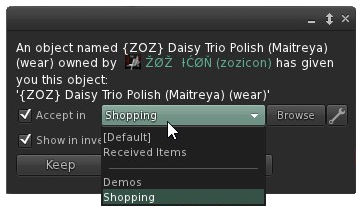

This is definitely one of the most important features of this releases and one that (I hope) will have the most impact on how you deal with shopping in Second Life and keeping your inventory manageable.

I’ve written about this before (see <http://blog.catznip.com/2017/03/catznip-r12-three-days-of-teasers-day-1.html>) so I won’t go into minute detail but essentially this feature attempts to keep your inventory more manageable and organized by letting you decide where a folder should go at the time you receive it.

Imagine going to a shopping event; some of the things you’ll want to buy on the spot, while others you’ll want to grab a demo of. Maybe you try it on the spot, or maybe you’ll accumulate all the demos and then teleport home to try things on at your own leisure. Most likely you’ll end up with a bunch of new top level folders cluttering up your inventory and some new things in your Objects folder. And if you sort that then and there anything you bought will end up hopelessly lost.

With this feature, you’ll now get a new drop-down when you get offered a folder (or on the buy floater as well) letting you decide where something should be saved to so for me personally, anything I buy I put into my “Shopping Bag” folder, and any demos I want to try I divert to my “Demos Only” folder.

Clicking the browse of the wrench icon will let you simply pick a folder, or provide you with more advanced configuration options:

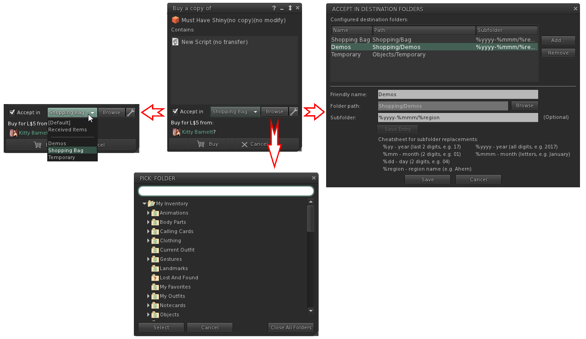

This means that if – for instance – I go to this month’s Uber event and buy something it’ll be auto-sorted to a special “Shopping / 2017-December / Uber” folder and even if I don’t unpack or touch a single box I’ll still have some semblance of a sorted inventory.

(You can get to the “Accept in” configuration floater from the Inventory / Gear menu and “Configure Accept In”)

### Accept in (Object folder)

As useful as the above is, it soon became apparent that boxed up items or demos still presented a problem: I like to demo things at my own house but if the demo is boxed up that means that the demo object is in the events folder (since I acquired it there), but the unboxed folder will be in a folder for my home region since that’s where I unpacked it.

Clearly there needed to be some way to keep the contents of an unpacked object near to where that object itself lives in your inventory and this new feature was born: for the most part (and if I did everything correctly) you shouldn’t even notice this too much and things will just work as you’d expected them to.

For instance:

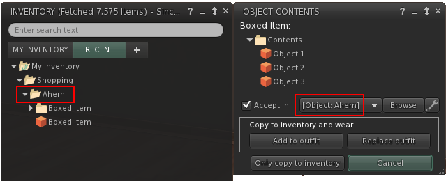

If the accept in destination is prefixed with the word “Object:” it simply means that I’m trying to be clever and offering to let you unpack an object into the same folder the item lives in rather than some completely unrelated folder elsewhere in your inventory.

Since there are as many inventory organizing schemes as there are residents, this might >not< be the behavior you want in which case you can click the little wrench icon and untick the following:

### Searching

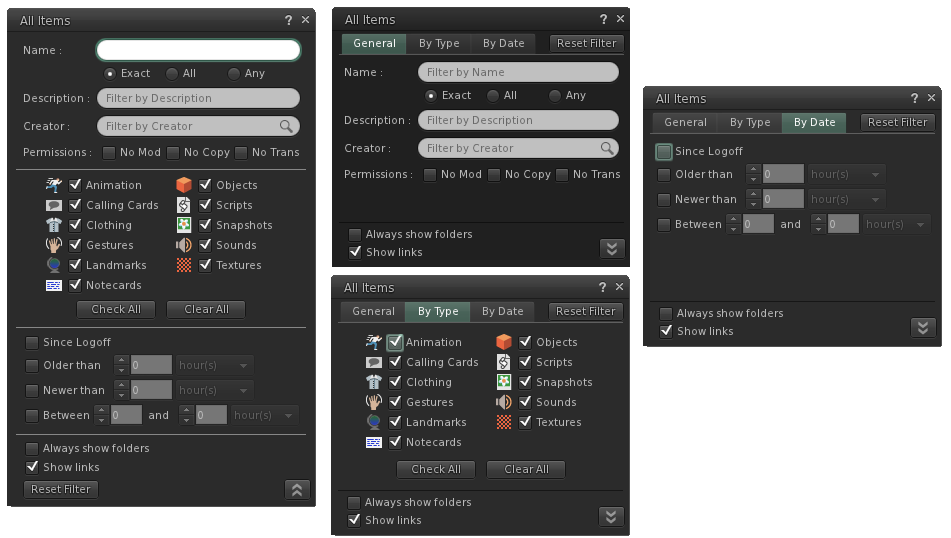

The next big inventory feature is the completely revamped inventory filter floater which comes in both an expanded (tall) version on the left, or the more compact (tabbed) version on the right. Simply click the arrows in the bottom right to switch between one and the other.

The biggest change here – and one that I end up using all the time now – is searching your inventory for a keyword. You’ll notice that at the top it says “Exact”, “All” and “Any”:

* Exact – search your inventory as you always have; an item needs to contain exactly what you type in order to show in the filtered list
* All (new) – splits what you type in words; in order to be visible an item needs to contain all of the words that you typed but not necessarily in that order
* Any (new) – again we’re searching by words but any item that contains at least one of the words you type will be show in the filter

Examples:

* I remembered picking up some Wasabi Pills hair 2-3 months ago and picking the Ombre pack so combining “ombre” >and< “Wasabi” (so an “All” search) instantly gave me what I needed

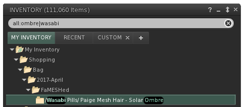!

* I needed to find a gacha kitty headband I got months ago. Good luck! So I searched my inventory for all occurrences of “band”, “head” >or< “hair” (so an “Any” search) and after a lot of scrolling I got it

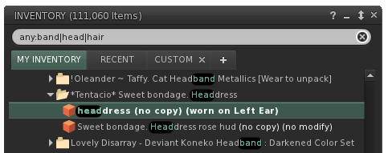

Play around with these a little bit and you’ll see that they’re extremely useful tools to let you find that specific item you’re looking for that would have otherwise been much harder to locate. Once you’re familiar with the “Exact”, “All” and “Any” concept pay attention to the shorthand code that’s appearing in the main inventory floater as well. You don’t need to actually specify a search type on the filter floater, you can simply prefix your regular search words with “any:” and “all:” as well.

Finally, since it was a special request it’s also possible to search your inventory using regular expressions (don’t worry if you don’t know what this means!):

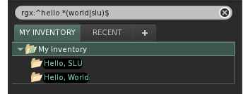

### Show Contents In

Often you'll be searching for something and either only the folder containing the items shows up, or only one of the items shows up. In that case, you can either right-click the item and go "Open in window", or cancel the current search and find the folder back but both of those are clunky and feel annoying.

With this feature you'll be able to right-click the folder and pick "Show Contents In / Current Search" which will make all the items in that folder visible regardless of whether they match the current search words or not.

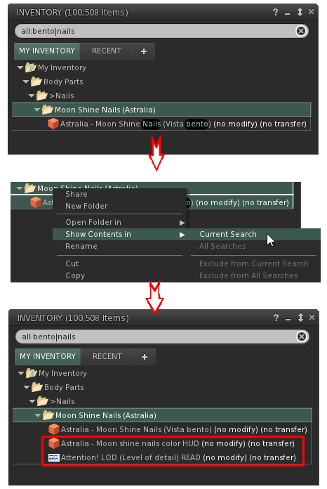

### Mark as protected/system folders

If you right-click one of your own folders you’ll have a new option to treat it as if It was a system folder: this means that it sorts at the top with the other system folders if you have “Sort System Folders to Top” checked and it will also prevent you from accidentally deleting it.

This doesn’t actually mess with your inventory but is rather a local setting; if you use multiple computers then you’ll have to do it for each once (I’m working on that!), and it won’t apply to any other viewers.

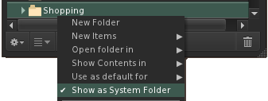

### Folder context menu enhancements

As you might be able to spot from the screenshot above I did some minor layout changes to the inventory context menu; with the new inventory options and LL’s new “Use as default” it felt like the menu was getting rather bloated; so in order to keep it manageable I decided to fold all inventory creation options into the “New Items” sub menu.

If you have any thoughts to share (good or bad) please do use the feedback option in the viewer; for things like this the only way I know whether a change worked out for the best or not is if you all tell me 😊.

### Take (Replace Links)

Firestorm added a convenient “Replace Links” feature which was then contributed back to Linden Lab and is present in R12 as well (you can read more about this on LL’s blog or Inara’s blog posts).

As an extra convenience I added a “Take (Replace Links)” option to the context menu of a rezzed object which will take the item into inventory and pre-fill the replace links floater.

(Note that the option will only show if the rezzed object has links pointing to it in your inventory)

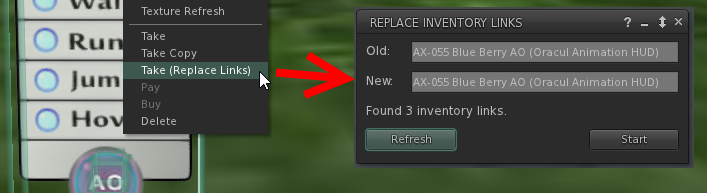

## Quick preferences

### Main

Catznip’s version of “quick preferences” was added in R11; R12 adds some minor functionality and enables the mysterious “quick inventory” tab.

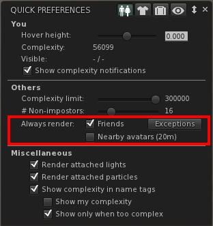
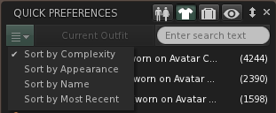

Minor improvements:

* CATZ-278 - The 'Quick Preferences' floater should be collapsible
* CATZ-293 - Add "Quick Preferences" to the main (Me) menu
The keyboard shortcut is Ctrl-Shift-P (the conflicting shortcut of 'Print Selected Object Info' was changed to Alt-Shift-P)
* Remember and restore the last active quick preferences tab
* Added a button for avatar rendering exceptions to the "Quick Preferences" floater
* Added a sorting menu to the wearing quick preferences tab

Bug fixes:

* CATZ-295 - 'Render Attached Lights' check box on the quick preferences panel doesn't turn off lights immediately

### Quick inventory

We all keep several HUDs attached in order to get to them quickly if we need to (i.e. mesh body/head HUD, or a hugger/dance/posing HUD) or worse, things we only need ever so often and if you’re like me, you’ll hate hunting them down in inventory because it feels clumsy and interrupt getting dressed.

The quick inventory panel is my first attempt at a way to define things you want to have quick access to:

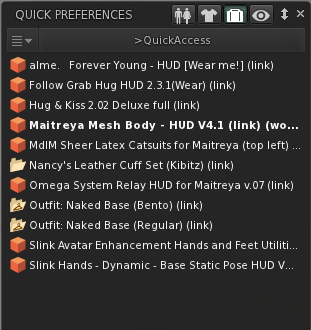

First you create a folder anywhere in your inventory, named anything you like (you might even already have such a folder at the ready) and fill it with links (or copies) to items you frequently need or, as you can tell from my example, you can put links to any existing outfits you might have.

Once the folder is set up, click the button on the quick inventory tab and you’ll get the floater that lets you navigate to the folder you just created. Additionally, there’s a mini search bar to help you filter down.

I’m sure that as I, and all of you, use this we’ll find more uses for it or things that can be refined or added so if you have any ideas or suggestions, please use the feedback button in the viewer 😊.

## Chat

### Group snoozing

“Group snoozing” first appeared in Catznip 5 years ago (and has since been picked up by Firestorm and other TPVs) but it was only ever available through the group chiclet’s context menu so it wasn’t very discoverable (or configurable aside from the debug setting).

R12 adds a per-group option to always snooze group chat when you hit the little x to close group chat, and a way to configure that specific group’s snooze time-out; the “next occurrence” option simply closes the group chat session until the next time someone says something (whether it’s 5 seconds after you close it, or 5 hours) which can be useful if you run a support group for instance.

To configure, go to Communicate / Groups – right-click the group you wish the change the option for and pick “View Info”. The option will be 2/3rd of the way down:

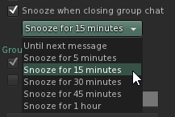

Additionally if you already have group chat open, you can always right-click the group’s chiclet and pick “Group Info” from there to get to the groups properties/profile floater or to snooze the group chat (using the default set).

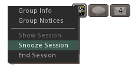

Finally, you’re also able to manually snooze group chat using the new chat toolbar icon; if you configured closing group chat to always snooze then you can for instance pick “Until relog” to not see group chat until you relog (or until manually reopen it).

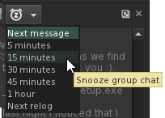

### Only join conferences started by friends

There’s recently been some griefing that involves joining busy groups only to then start mass-conferences with group members; this option will only accept conference conversations that were started by someone on your friends list. If a conference is blocked you’ll briefly see a toast and a message will be logged to nearby chat.

Additionally, I also provided an option to auto-ignore all group voice calls (note that this doesn’t block voice conferences from friends or non-friends).

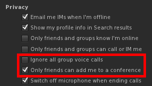

### Chat History

LL added the chat history a couple of years back but it – at least to me – never ended up feeling like it could replace hunting for the log folder and then opening the chat log in Notepad to search for what I wanted. In R12 it got a bit of a polish and three new functionalities were added to hopefully start making it more usable/friendly:

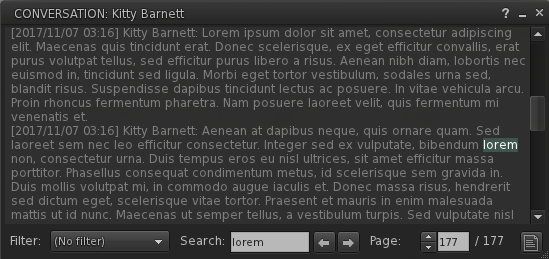
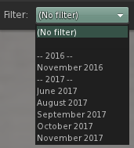

* The drop down allows you to filter the chat history down to a specific year (or month)
* The search box will search through the chat history for the specified word/sentence. Note that when you open the chat history it opens the last page by default so if you search for something you’ll need to click the back button to search back in time.
* The text file icon will, when clicked, open the chat log in your standard text editor (e.g. Notepad)

The following bugs relating to the chat history were also fixed:

* Viewing the chat history of someone who isn't in conversations.log opens an empty history when legacy names are enabled
* The "chat history" floater always starts on page 0
* The "chat history" floater doesn't remember its last position and/or size
* CATZ-341 - Disabling "UseLegacyIMLogNames" doesn't use the same chat log names as the LL viewer
* CATZ-360 - Added missing “chat history” button to the nearby chat toolbar

## Magnifying glass on avatar profile picture(s)

When you hover over a profile texture on the (legacy) profile floater, About Land, a group’s profile, … your cursor will show the zoom option which will open a texture preview floater of that texture (note that you do not have permission to save it to disk) with a fixed aspect ratio that matches the texture control’s.

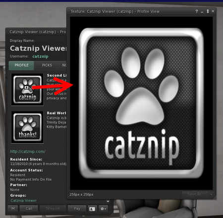
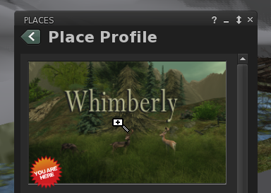

## Notifications filtering

In R11 the notifications floater was revamped; in R12 there’s a new option for those of us who keep old notifications around but still want an easy way to see which notifications (group notices) are new. The “Since Logoff” option will (similarly to your inventory’s Recent tab) show only those notifications that were added since your last logoff (and any from the current logon session).

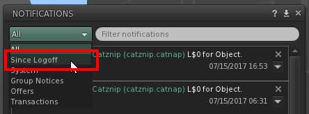

Additionally, every month the Luxe Box group is filled with people who don’t know how to get to a group’s notices so as a reminder there are 4 additional ways to easily get to the group notices in Catznip (does not apply to other viewers):

* From a group notice by clicking the group name (requested by a user and added in R12)

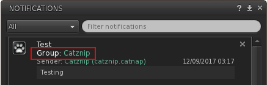

* The envelope icon in the group chat tool bar

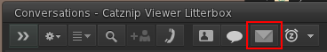

* The “Group Notices” option in the group chat’s chiclet right-click menu

* The “View Notices” option in the right-click menu of the People / Groups tab

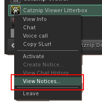

Additionally you’ll be able to instantly open the group’s profile by right-click the group’s name in the group notice, as well as the notice’s sender.
Related bugfixes:

* CATZ-324 - Notification close/delete button moves to the right when closing many notifications in a row
* CATZ-355 - Group notifications in the notifications floater are shown in GMT

## Building

### Texture flip

Another long-time request since LL took this away; clicking the button will flip the horizontal/vertical scale (for diffuse, normal or specular depending on your current edit mode).

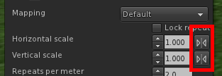

### Hex/HTML colour value support

I was trying something with complementary colors and got annoyed that I had to keep converting from hex color value to RGB so there you go 😊.

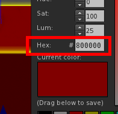

## Region restart floater shaking

This was a long time request, sorry it took so long to get around to it but it’s finally here 😊.

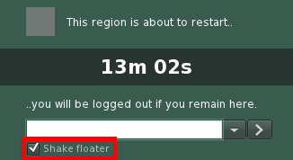

Related bugfixes:

* CATZ-296 - Region restart shows the wrong remaining time
* Region restart floater is missing its green/red background

## Increased texture memory

With the move to 64-bit it’s finally possible to increase the viewer’s texture memory allowance; since it seems LL has already been working on this I’ve only done a minimal change. Since I don’t have access to a wide variety of video cards it’s possible you still may not be able to change it beyond the old 512Mb limit.

Finally, keep in mind that your video card’s memory is shared between all currently running programs (i.e. browser tabs), so even though your card might have 2Gb or more of RAM the slider is conservatively capped at 1/3rd of total.

Change it in Me / Preferences – Graphics tab and Advanced Graphics (a revamp of the graphics preferences is coming! I know the default is horrid ☹).

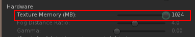

For those on the Windows 10 Fall Creator update you’ll have a very easy way to monitor your GPU memory usage by using the Task Manager:

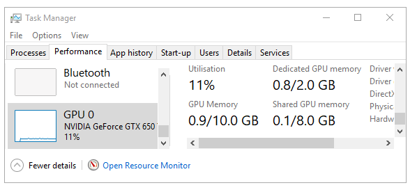

(Note that the texture memory slider has been excluded from graphics presets – see CATZ-351)

## Mouse walking

This has also been an on/off popular requested feature since it's apparently a big deal in WoW, and the standard way you move around that world. I’d really appreciate feedback on whether I got it right or wrong or if you have any suggestions for change.
The following 2 changes were made:
*When you hold down both the left and right mouse button on your own avatar you'll start walking forward for as long as at least both buttons are held down (so in order to stop walking you need to release at least one button). While you're walking you can move the mouse around to steer; this hasn't changed and was always the behavior when the left mouse button was down on yourself (or your own name tag).
If you keep only the left mouse down then the camera will rotate along with your avatar; if you keep only the right button down then the camera will rotate around your avatar which will keep facing the same way (it’ll make more sense when you try it 😊).

 Click your avatar (or name tag) with both mouse buttons to start moving forward. Move the mouse to steer. Release both buttons to stop, or release one to allow camming (see below).

 When you let go of the right mouse button and keep holding down the left button you can orbit the camera and your avatar will turn to face the same direction.

 When you let go of the left mouse button and keep holding down the right button your camera will orbit but your avatar will keep facing the same way.

 Pressing both buttons once more will move you forward once more.
Note that you can switch between walking and running using the “Always Run” toggle [Ctrl-R].

* In WoW holding down the left mouse will orbit the camera around your character without changing its orientation while right-click holding will orbit and rotate your character as well. In Second Life the left-hold-orbit has already always rotated your avatar around so I didn't want to touch that, secondly context menus are always supposed to open right after the mouse goes down so instead I had to use the middle mouse button to allow you to orbit around without actually turning that way.

(Note that by default the middle mouse button is bound to “Talk” for voice chat – if that hasn’t been changed this feature is disabled)

While the middle mouse button is down the left and right mouse buttons will act as modifier keys:

* Middle mouse down: same as holding down the Alt key
* Left + middle mouse: same as holding down the Ctrl+Alt camera modifier
* Middle + right mouse: same as holding down the Ctrl+Alt+Shift camera modifier
Try it out and provide feedback as needed 😊.

## Avatar rendering exceptions

When you right-click someone you (see screenshot) you have the option to always render that avatar regardless of your avatar complexity settings (or never render them) but that preference didn’t persist and was lost on every relog.

R12 incorporates the avatar rendering list in the blocked/mute list floater (see screenshot) which you can get to from the normal places as well as the quick preferences appearance panel.

Note that the avatar rendering exception list is stored locally and per-viewer (requests to change this need to go through LL’s JIRA unfortunately, it requires a minor server change to how the mute list is stored).

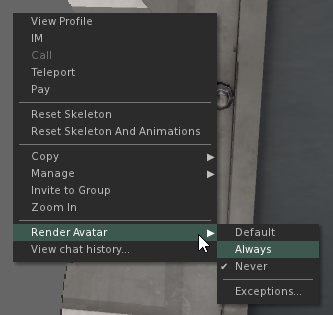
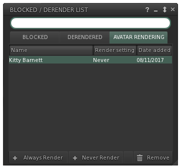

## RLVa

No new functionality but the following bugs were fixed:

* CATZ-301 - Typing animation still starts when @redirectchat restricted
* CATZ-311 - @stopim doesn't end the IM session when @startim restricted
* CATZ-317 - Texture tooltips should be blocked when @viewtexture=n restricted
* CATZ-319 - Texture preview still available when @viewtexture=n
* CATZ-332 - Crash saving a texture to disk while @viewtextures=n restricted
* CATZ-350 - Can't force ground sit while avatar is moving
* Chat animation isn't properly adjusted when @chatwhisper/normal/shout restricted
* @camdist[min|max] and @camunlock aren't enforced when using a scripted camera

## Various minor improvements

* CATZ-297 - Add Strawberry Singh's 'Light Up My SLife' and 'Headshots' Windlight sky presets
* CATZ-312 - Add an item for the Recent tab to the 'Communicate' menu
* CATZ-373 - Add Block / Unblock to the agent SLURL context menu (right-click their name in chat/IM/groups)

## Various other bugfixes

* CATZ-277 - Teleports no longer log to nearby chat
* CATZ-281 - Double-clicking the group list scrollbar starts a group chat session
* CATZ-287 - Place inspector no longer appears on the world map
* CATZ-289 - Eject / Ban options are missing on the group chat context menu
* CATZ-292 - (Re)set "reapply current Windlight settings at logon” as the default
* CATZ-303 - Group moderators not sorted to the top of the list in group chat
* CATZ-304 - Double-clicking names in the group chat list does nothing
* CATZ-306 - Hotspot to drag and drop attachments to notices is misplaced
* CATZ-313 - Closing the 'Replace links' floater crashes the viewer if a replace is in progress
* CATZ-337 - 'UI Size' can't easily be reset to 1.0
* CATZ-364 - Render quality in the 'About' floater appears to be zero-based
* CRASH-4 - Crash when closing a chat conference through the IM well floater (or right-clicking the IM well button / Close All)
* 'DeleteItems' notfication can’t be permanently ignored
* Can't eject a member in a group role from the participant context menu
* Clicking between the world and the inventory floater freezes the viewer
* Show eject/ban confirmation request and enable the context menu option for both single and multiple selections
* Crash when opening the wearing panel right after switching outfits
* Crash when opening the legacy profile floater with no avatar
* Incoming IMs and nearby chat messages freeze the viewer
* Searching a text editor backwards breaks when mSelectionEnd < mSelectionStart
* Show the appropriate folder icon for folder links in inventory list controls

## New website + backend

Last, but certainly not least there's also been a lot of work done on a new Catznip website, as well as completely redoing the way the updater and crash reporter work. We'll be slowly unveiling this over the course of the year but for now you there's at least the new download page @ <https://get.catznip.com>!

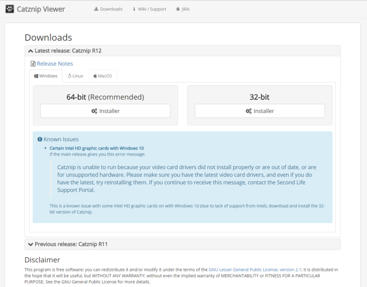
