# Catznip R12.1

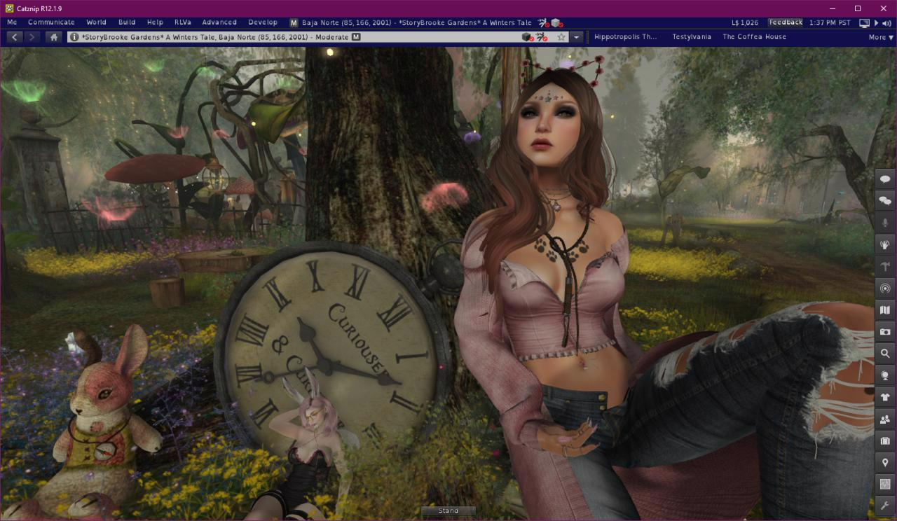

## Optimizations

A lot of work went into optimizing this Catznip release: neither Coffea or I have recent hardware which makes it important that additions don’t negatively impact our own overall experience (FPS, etc). The same is true for features added by Linden Lab. Animesh in particular had a very negative impact on performance which we have largely negated with some extra work (including a fix from Beq for rendering rigged attachments with shadows enabled).

Actual performance improvements often depend on your specific computer: all being well, performance should be at least that of R12. If your computer is CPU bound and has GPU to spare then you should see an improvement. If you don’t currently have shadows enabled because it was a little too slow to have enabled all the time, try enabling them with the new release, for some the change is enough to allow “shadows by default”.

Given the wide variety of hardware and settings out there, we would really appreciate to hear your feedback. Especially if it’s worse; or worse under specific circumstances; and of course if you noticed an improvement we’d love to hear from you as well.

## Render Others As

One popular suggestion was to add an option to only render friends in order to improve frame rate for busy (shopping/music) events.

In Catznip tradition I ran with the suggestion and gave it a Catznip twist so now we have an extra “Render” option on the quick preferences panel.

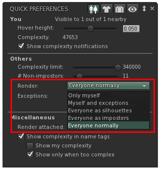

Before explaining the new options in-depth I’d like to make sure everyone is on the same page with how the complexity settings works so let’s start with a quick recap:

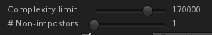

The complexity slider determines the maximum complexity that avatars around you can have: if their avatar cost is higher they’ll be rendered as a jelly doll (coloured imposter).

The # Non-impostors slider determines how many nearby people that are under your complexity limit will be rendered in full, while everyone else will be shown as an imposter (a jelly doll that isn’t a uniform colour but rather still has all the textures of the actual avatar).

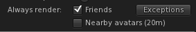

Catznip then added an easy way for you to select that friends should always be rendered in full, regardless of your other settings, and additionally everyone standing near you (within chat range) as well as individual exceptions.

The new options are (from bottom to top):

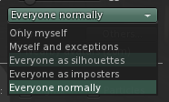

* Everyone normally – the default: with this selected people will show as they always have (and subject to the settings)
* Everyone as imposters – this basically overrides your “# Non-impostors” slider and shows those around you as an imposter (except the people that fall under your exceptions). This will provide a noticeable FPS boost, and is best combined with leaving “Nearby avatars” unchecked
* Everyone as silhouettes – this takes the setting above one step further and shows everyone as an untextured outline. This setting will work best with “Nearby avatars” unchecked. Recommend this is enabled before teleporting to a busy event as this will prevent all avatar related textures from being downloaded, loading the vendors faster and saving texture memory by not downloading textures for silhouetted avatars.
Example:

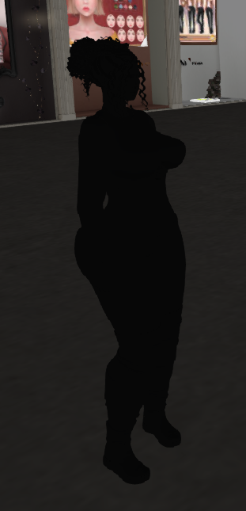

* Myself and exceptions –  “hide” everyone around you except for those specified by exceptions. You can add specific avatars as an exception so you can see people who aren’t on your friends list.
* Only myself – Finally, if nothing else works (or if you’re just trying to take a picture and people keep running into view!) this option will render you and only you.

If none of the above made much sense then don’t worry; it’s really easy so just play with the option and give it a try and you’ll find what works best for you easily.

!!! tip "During testing we found that we would often forget that we turned off the rest of the world!"
    As long as a non-default setting is active the following appears on the bottom of your screen as a reminder you that you’re potentially hiding people around you (it won’t show up in snapshots, don’t worry 😊).

    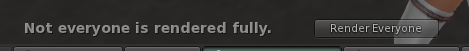

## Login screen

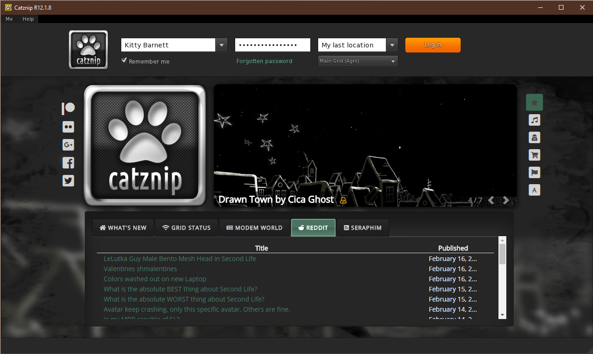

Most likely the very first thing you’ll notice about R12.1 is that the login screen has gotten an overhaul.

To the right side of the Catznip logo you’ll see the parcel highlight slightly improved from previous; it cycles through all of that categories highlights every few seconds. It now has an the indicator providing a rough indication of how populated a location currently is (3 green people being the busiest down to 1 green person for >1 and a hollow orange for deserted). For instance:

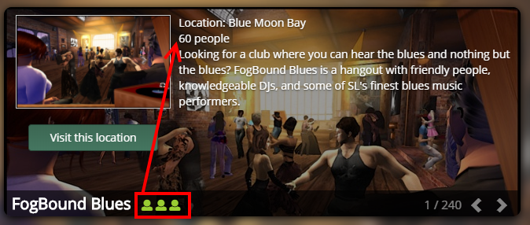

While it’s easy to find places in Second Life, it’s not always easy to find places to be social, so this will hopefully help in discovering new and fun places with people to interact with.

Also new is the category selector on the right:

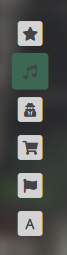

You can hover your mouse over the categories to see what they are and clicking them will switch the carousel over to that specific category.

Down at the bottom we have:

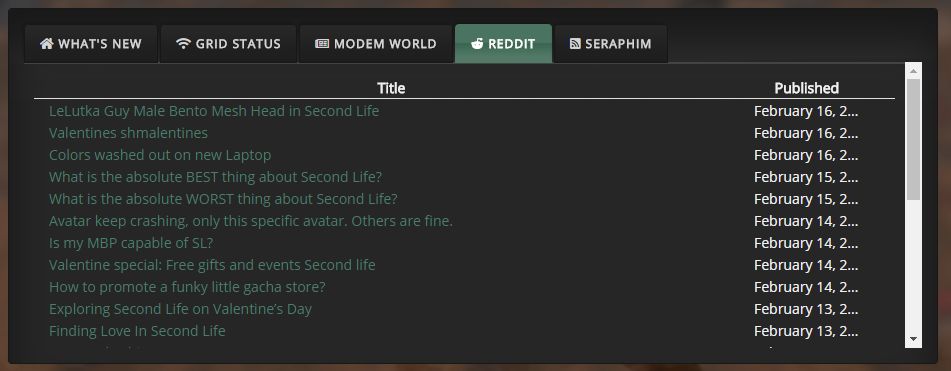

* “What’s New” is primarily useful during beta runs when it shows a list of all the JIRAs that were fixed or added for that particular beta
* “Grid Status” : all recent posts on the LL grid status “blog”
* “Modem World” : Inara’s RSS feed to keep up to date on most things SL
* “Reddit” : The most recent threads from the SL reddit community
* “Seraphim” : RSS feed for all the shopping addicts among us, clicking the location column will set your login location to that specific event.

We’d really love your opinion on the new login screen as well: the good >and< the bad! We’ve tried to make it be an actual part of your SL experience and present a lot of the most useful information to you as well as be an aid with the eternal question of “what to do in Second Life”.

## Minor Features

### Texture previews

* CATZ-456 - Show a texture tooltip for inventory floaters that only contain a single texture
* [FIXED] CATZ-457 - Texture previews and inspectors load slowly

If you’ve used Catznip for a while, you’ll most likely have noticed that when you hover over a texture in your inventory that you’ll get a thumbnail preview of that texture.

Similarly to opening a texture preview they could sometimes take a while to open if they weren’t already in your texture cache. While not quite instant, the loading time of texture previews (whether as a tooltip or opening the full preview floater) should be noticeably faster in R12.1.

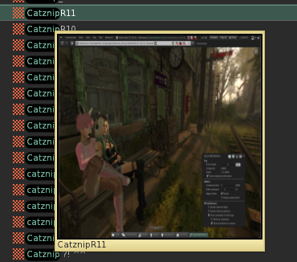

Additionally, when hovering over a folder that contains a single texture you’ll see a texture tooltip for that folder. For vendors that include the product picture with your purchase; or for those who meticulously take pictures of clothing items and/or outfits this gives a very quick and visual way to go through folders, without having to open and examine each.

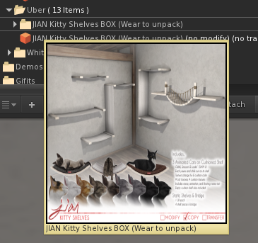

### Chat

* CATZ-386 - Allow the user to control how much vertical screen space is taken up by nearby chat toasts
* CATZ-436 - Add preference options to control how long nearby chat toasts stay visible
* [FIXED] CATZ-435 - The collapsed nearby chat floater drifts down every time its visibility is toggled
* [FIXED] CATZ-434 - Clicking 'Chat' on the toolbar hides nearby toasts when the nearby chat floater is collapsed

Under the main Me menu / Preferences and then the Chat tab you’ll now find more options to control how much vertical screen space can be occupied by nearby chat toasts and how long they linger on the screen before starting to fade.

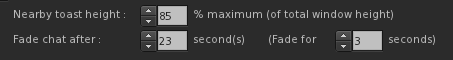

For those that wonder: the width of nearby chat toasts is actually derived from the width of the nearby chat floater. If you make it smaller or wider while nearby chat is visible you’ll see them resize on the spot to match.

(There’s a debug setting to set them to a fixed width but I wouldn’t actually recommend doing that).

### Show in Inventory

* [FIXED] CATZ-309 - 'Show in Inventory' check on inventory offers doesn't open inventory
* [FIXED] CATZ-317 - "Show in Inventory" checkbox doesn't seem to work on the buy/pay floater
* [FIXED] CATZ-453 - Clicking 'Show' on an notecard offer doesn't open the preview floater
* [FIXED] CATZ-461 - Right-click inventory offer / Show Inventory Item yields an error
* [FIXED] CATZ-462 - Clicking on the inventory item SLurl doesn't preview the item
* Added 'Preview Item' to the inventory offer context menu

Catznip added the “Show in inventory” options to inventory offers and purchase floaters a while back, but it still never felt like it was doing quite what what expected; mostly due to 3 debug settings of which 2 directly conflicted. That’s been cleaned up and (hopefully) simplified.

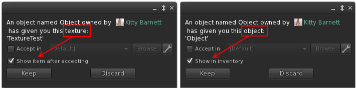

Inventory offers for an item that can be previewed (notecards/landmarks/textures) now offer to show the object rather than its location in inventory.

### Building

* CATZ-384 - Add select prev/next link buttons to the build floater
* CATZ-413 - Allow texture repeats larger than 100

When ‘Edit Linked’ is checked, you can use the next and previous buttons to cycle through the individual links of a link set.

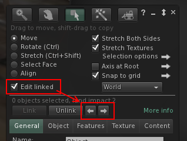

### Avatar Fix menu

* CATZ-430 - Group avatar troubleshooting options together in a sub-menu for both self & others
* CATZ-431 - Option to restart (a.k.a. sync) an avatar's animations (or the animations of all avatars)

All context menu options that you might (frequently) use to resolve a problem with an avatar in some way are now bundled under a ‘Fix Avatar’ submenu.

* Rebake Texture  (default LL option)
* Refresh Textures – Clear and redownload all textures on every attachment including (baked) body textures
* Refresh Attachments – If one of your attachments ends up ghosted (you see it but others don’t) then this will fix it for both of you
* Sync Animations – Restarts the animation of every other avatar on the same object you’re sitting on (or every other avatar playing the same animation as you are)
* Reset Skeleton (default LL option)
* Reset Skeleton & Animations (default LL option)
* Stop Animating Me (default LL option)

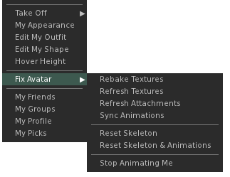

Synchronizing animations was a long time request so I’m happy to finally add it, however it might work a bit different to what you’re used to on Firestorm. For instance: if you pick the option for an avatar then the animations that avatar is currently playing, along with animations of everyone sitting on the same object, will all be restarted. This should give a smoother fix of just the people you want rather than reset everyone around you.

A global “Sync Animations” option has been added under the Advanced menu, this restarts all active animations.

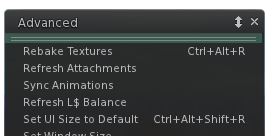

### Appearance

* CATZ-481 - Show current/unsaved changes on the wearable edit panel

While editing your shape (or any wearable such as alpha, physics, shirt, etc…) any change you make will be shown in bold with an asterisk behind the name. In addition, the category that parameter belongs to will show in bold with an asterisk as well.

Dragging a slider back to its previous value will switch it back to an unchanged state so you can always tell, at a glance, what exactly you’ve changed and what will happen when you press the ‘Save’ button.

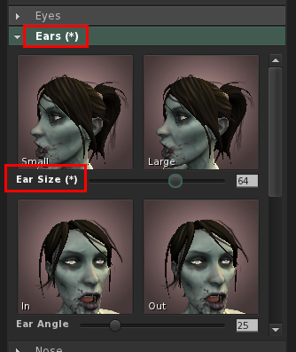

### Windlight Quick-Prefs

* CATZ-414 - Add 'Reset Windlight' to the Troubleshooting tab
* CATZ-459 - Minor improvements to the WindLight quick preferences panel

The Windlight quick preferences panel got a few minor changes:

* There’s now a slider for both ‘Scene Gamma’ and ‘East Angle’
* “Day Cycle”, “Fixed Sky” and “Water” have a third button that directly opens the edit floater
* A “Reset Windlight” button to go back to the default (the same button is also present on the Troubleshooting preferences tab)

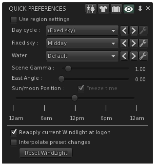

### Wearing appearance panel

* CATZ-343 - Show the total/remaining attachment count on the Wearing panel
* CATZ-427 - Touch/Edit context menu options on the Wearing panel are missing for temporary attachments
* [FIXED] CATZ-421 - Can't detach a temporary attachment from the Appearance / Wearing / Temporary Attachment accordion

The appearance wearing panel had a number of small bug fixes (see above) as well as the number of worn (and total available) attachments and quick count of temporary/experience attachments.

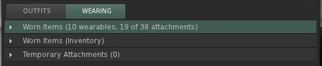

### Drag & Drop

* CATZ-411 - Drag & drop texture upload broken
* CATZ-415 - Show the image upload preview when drag-and-drop uploading a texture
* CATZ-416 - Enable drag-and-drop uploading of animations, sounds and mesh models

Drag & drop uploading from Explorer has been in Catznip for a while and now supports all file types that can be uploaded in the viewer. Additionally, when dropping a single file the upload floater will appear so you adjust settings (or preview).

## Bugfixes

This is a list of all the other bugfixes included in this release :

* CATZ-154 - Resizing 'resident info' pane of IM window should maintain 1:1 aspect ratio while scaling profile picture
* CATZ-236 - Crash reports don't include partial logs
* CATZ-375 - Limit the texture memory slider to 2Gb maximum
* CATZ-380 - Snoozing a group for an undefined time should use that group's specific snooze duration rather than the global default
* CATZ-382 - Group list on the profile floater is incomplete/cut off
* CATZ-383 - "Received items" folder isn't visible on user added inventory panels
* CATZ-401 - Inventory floater pops up when right-clicking in Appearance / Outfits
* CATZ-402 - Don't make a sender's name clickable on collapsed group notices
* CATZ-403 - 'Share' missing on inventory context menu
* CATZ-404 -  CONTROL_LEFT/CONTROL_RIGHT isn't sent while focus is on a text control
* CATZ-409 - Increasing the RAM backed texture cache beyond 2Gb causes an overflow
* CATZ-412 - Don't stop the audio stream when crossing parcel borders (with the same stream URL)
* CATZ-418 - Username dropdown on the login screen doesn't remember the last logged in user
* CATZ-419 - Chat following a teleport/friends offer isn't (always) visible in the IM conversation
* CATZ-423 - Sculpt maps aren't being refreshed when using "Texture Refresh"
* CATZ-425 - Unable to derender items on a banned parcel
* CATZ-429 - "Sit Down" option on the avatar self menu disappears when flying
* CATZ-433 - 'Display name' label truncated on the profile floater
* CATZ-437 - Changing outfits doesn't update the "worn" suffix on the outfit folder in inventory
* CATZ-438 - Hitting ENTER on the login name field should start log-in
* CATZ-449 - Complexity is visible in the name tag of blocked/muted avatars
* CATZ-455 - Don't make people a multi-millionaire when their L$ balance was unavailable
* CATZ-458 - Teleport offer/request toasts can become 'stuck' on the screen
* CATZ-479 - Money balance, offline IMs/offers or early chat/RLV commands can get lost during login
* Crash reporter doesn't understand status 400 code(s)
* The spinner control's label baseline is offset from the baseline of the text editor
* Various text/label overlap/cut-off issues in Preferences
* Various text/label overlap/cut-off issues on the Quick Preferences panels

## Crash fixes

* CRASH-23 - Crash in writeToRecorders() on log out
* CRASH-24 - LLImageGL::createGLTexture() LLError

## RLVa v2.2

Please read RLVa_2.2_Release_Notes for the detailed RLVa release notes.

--8<-- "includes/abbreviations.md"
