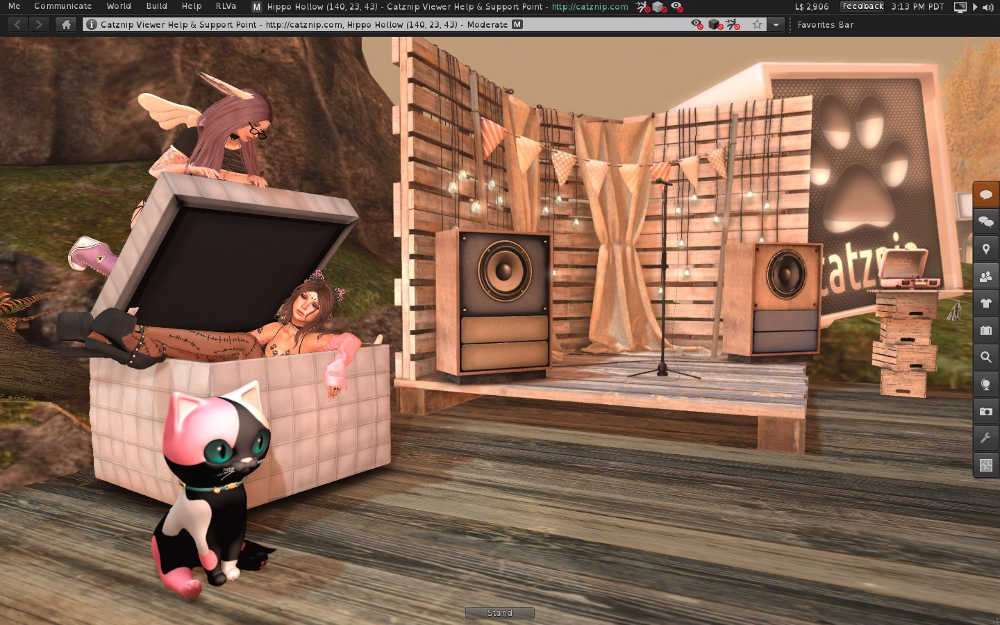

# Catznip R12.3

No Kitty magic in this one, but it does bring you 'Bakes on Mesh' and is up to date with the current Linden Lab viewer (with some minor bug and crash fix sprinkles to make it complete).

## Bakes on Mesh (BoM)

* Linden Lab's Knowledge Base article: https://community.secondlife.com/knowledgebase/english/bakes-on-mesh-r1512/
* Inara's article: https://modemworld.me/2019/08/27/bakes-on-mesh-a-basic-primer/

(Note that even if you don't plan on using BoM you still need a BoM-enabled viewer to see others correctly)

## Bugfixes
* Minor installer issues
* Revert SL-1579 and allow taking rezzed items if their originaitng folder was 'Receved Items'
* Crash in busy/crowded places while camming around (thank you Nicky from Firestorm)
* CATZ-532: Avatar (sometimes) ends up deformed when detaching something while an animesh attachment is worn
* CATZ-535: Remove Google+ links
* CATZ-539: 'Creator name' on the build floater is always disabled
* CATZ-542: 'Render everyone as' setting affects your own animesh attachments
* RLVa - FIRE-24230: Login crash when RLV @showloc restricted with no teleport history file
* RLVa - BoM universal layer is missing from @getoufit

## Linden Lab viewer changes
LL Release Notes: https://releasenotes.secondlife.com/viewer/6.3.1.530559.html
