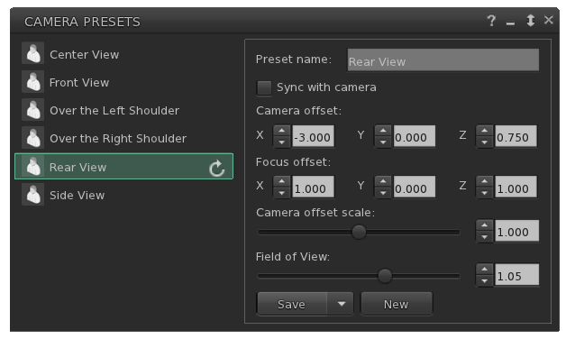
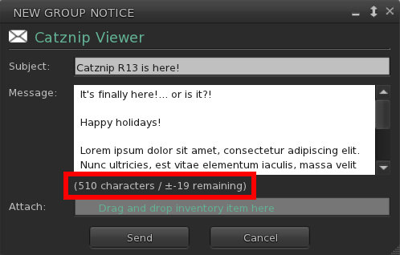
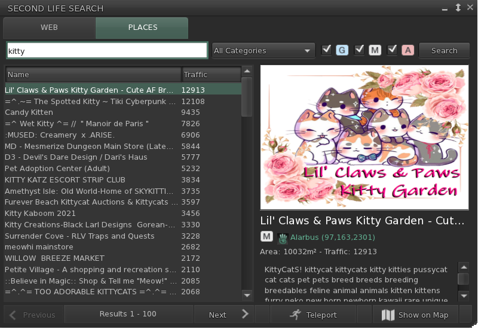

# Catznip R13

<video class="video-item" autoplay="" loop="" muted="">
    <source src="Catznip-R13.mp4" type="video/mp4">
    Your browser does not support the video tag.
</video>

It's definitely been a very long road to get to this point but we've finally broken the curse and R13 is here in time for the new year!

If you're reading this you'll notice we have a brand new release notes page and we've been working behind the scenes for many other improvements to streamline releases.

We're getting close to being able to bring you much faster updates and new features than we've been delivering over the past year and you'll hear more about that very soon (keep an eye out on group notices!).

## Mac version

Thanks to a hardware donation (you know who you are! ♡) we have a working Mac again to test and develop on!

The beta feedback has been largely positive but new Mac users should expect some rough edges; please do let us know about any problems you run into through the "Feedback" button at the top of the screen (next to your L$ balance).

We already know we have the **best** installer out of all Second Life viewers, obviously...

## Camera presets

The viewer has had the ability to let you change between 3 fixed camera presets for a while now; or even to set a custom camera viewpoint for those who wanted to delve into the debug settings. With the camera presets feature Linden Lab made it all a lot more accessible to everyone, even if it did come with quite horrible UI (it doubled in width – see below).

From experience we know that people prefer a very minimal camera floater, so I did my best to keep things as tight as possible while still making the new feature easily accessible to everyone.

You can read more about the feature and how to use it in Inara’s tutorial @ <https://modemworld.me/2020/05/19/tutorial-viewer-camera-presets/> . Do keep in mind she is referencing the official viewer’s user interface, but everything should be clear enough to find your way around in Catznip if you keep on reading below 😊.

In integrating the feature we also came up with a few innovations of our own. For instance, you might have noticed there are now two sliders in between the orbit and pan controls:

* The left slider controls the camera zoom as it previously did (=using the scroll wheel on your mouse). When focused on an object we’ve also slightly tweaked the slider values so you’ll have more control when the camera is closer to the object rather than instantly fly off into the distance.
* The right slider controls the field of view (= Ctrl-8 / Ctrl-0) which is more commonly used to ‘zoom’ in tight to an attachment for editing.

Additionally, both will now snap back to their default when resetting the camera (by hitting Esc). If you do want a different FoV you can change the default and then save your camera preset (see below) and it will always snap back to your desired value on reset.

The dropdown lets you choose from your available presets and we have included the popular Penny Patton ones in the viewer by default. Pressing the gear icon will open the presets floater which is significantly different from the official viewer’s (which confusingly has 3 separate floaters to do the same thing).

On the left side you will see all presets. Clicking one will show you its detailed values on the right. The ‘Refresh’ icon will only show on presets that are included in the viewer by default and allow you reset them back in case you’ve made changes to them that you’re not at all happy with.

To create a new preset, simply click the New button at the bottom right. To save your changes click Save; or click the down arrow to save your current values as an entirely new (custom) preset.

You can immediately jump into changing the values; however you also have the option to pick ‘Sync with camera’ and move your camera into a rough starting position. Then uncheck the option when you have positioned it where you want it and tweak the values slightly to your liking before saving.

To delete one of your own custom presets, hover over it on the left side and click the trash icon that appears.

 Finally: remember that Catznip has a transparency slider specifically for the Camera and Move floaters at the Me menu / Preferences / Colors tab. If you are one of the people who always keeps (one of) those floaters on screen, setting a low opacity will leave it accessible but not obscure part of the world.

## EEP / Windlight improvements

### Quick Preferences

The panel went through a complete redesign and we would really love your feedback on it (especially if there's something you want quick access to that we forgot!)

'Use Shared Environment' is the same as the World / Environment / Use Shared Environment menu option.

'Personal Lighting...' will open the personal lighting floater (which we haven't changed - yet).

The ❮ [left] and ❯ [right] buttons cycles you through the available options

The wrench button immediately opens the 'Edit Environment' floater allowing you to make one-time changes or to save (a copy of) your changes.

'Reapply current Windlight at logon' is the same as before and will keep your Windlight settings consistent across relogs when checked. When unchecked you will always default to the 'shared' environment.

'Interpolate preset changes' will transition you from one setting to the next over 5 seconds when checked; or will change instantly between settings when unchecked.

Since Windlight settings can now be present in your own inventory as well as the default library settings we've made it clearer in the dropdowns to see where a setting your picking is located in your inventory

### Active (Windlight) setting indicator

When a Windlight (day/sky/water) setting is currently active you'll now see an 'active' indicator behind it in My Environments and the inventory floater.

### Edit library assets

Normally, if you want to make small changes to a stock/library Windlight setting you'd first have to copy that item into your own inventory and then open it to make edits.
This quality of life improvement allows you to open Windlight settings straight from the library (right-click inventory / Open) and then make your changes.
When it's time to save, click the 'Save As' button which will save the new environment in your 'Settings' folder.
(Remember that you can also pick 'Apply Only To Myself' to make temporary one-time changes without needing to clutter your inventory with unnecessary settings items).

### Floater cleanup

Most of the Windlight floaters were cleaned up to make them take up less of your screen without feeling too cramped.

## Improvements

### Beacons

I have added an option to control the height of the beacons which is particularly useful if you are trying to find the one scripted object in a sea of red lines that stretch to infinity.

Using a height value of 4 for instance will give you a lot more spatial detail on where each beacon is located and marks tracking down an object so much easier.

I have also added an option specifically to highlight light sources which can be useful if you’re trying to set up a picture or any situation where you might have an unwanted light source that isn’t immediately obvious.

### Group notice

* CATZ-530 - Show 'remaining characters' on the group notice floater

### Places search

* Pressing ⏎ [enter] on the text editor will run the search
* Pressing ⬇ [down] afterwards will jump to the first result (where you can then use the arrow keys to navigate between them)
* Pressing ⏎ [enter] on a search result will teleport you to that location
* Clicking the search button manually will also set focus to the first result
* Double-clicking a search result will teleport you to that location

### Resolution scale

If you're really struggling with your FPS then you can give the new resolution scale slider a try (it's under Me / Preferences / Graphics / Advanced).
At 100% (all the way to the right) everything looks at normal; at 50% (all the way to the left) the viewer will render at half the normal resolution leaving you with a blockier view but hopefully a more manageable FPS (or allow you to enable Windlight / ALM where you otherwise couldn't).
Play around with the setting - we've found there's definitely a sweet spot but it's different for each specific computer configuration.

### Minor improvements

* CATZ-547 - Option to turn off extra lighting that is applied when editing appearance
* CATZ-557 - Improve initial opening time for the landmarks floater (+ improved filtering performance)
* CATZ-584 - Give visual feedback when using an invalid regex for an inventory search

* CATZ-593 - Add option to sort Nearby and Friends list by username (cause nagging pony)
* CATZ-594 - Opening the feedback floater should give focus to the feedback form
* CATZ-597: Add link to Discord server and clean up social media links
* CATZ-601 - Increase default and minimal texture cache size
* Add a button to open the 'Camera Presets' to preferences and remove the settings that are now part of the presets floater (namely camera focus offset and field of vision)
* Increase the maximum allowable texture memory limit from 33% to 50% of total
* Show the default value on slider controls (no snap to default but rather it's a bit 'sticky' once reached)
* Embed a no manifest copy of the viewer executable in the installer to cater to legacy Intel video cards with drives that won't run on Win10

## Bugfixes

* CATZ-222 - Restoring a derendered object does not immediately make it visible again (it required a teleport away and back)
* CATZ-274 - Unchecking 'Turn Towards Selection' still turns the avatar towards a selected object
* CATZ-321 - Toggling "Arm Points Towards Selection" does update your avatar if you currently have an object selected
  * Reminder: you can toggle this and ‘Turn Towards Selection’ from the Build / Options submenu (or by clicking the arrow next to ‘Selection Options’ when the builder floater is open).
* CATZ-353 - Script color changes aren't applied to existing script floaters
* CATZ-521 - 'Hide All Controls' should hide the chiclet bar
* CATZ-528 - Help / About - Release Notes link does not work
* CATZ-543 - Object name is only partially visible on the 'Pay' floater
* CATZ-549 - Can't reposition some HUDs using the edit floater (manual entry or using the X/Y/Z spinners)
  * For instance the Maitreya HUD needs negative values to move it closer to the top left of the screen
* CATZ-578 - Worn items are moved into Lost-and-Found at log off for some users
* CATZ-580 - Delete button overhang on the picks floats
* CATZ-591 - 'Browse' button on the Preferences Snapshots tab is in the wrong position
* CATZ-592 - Triple-clicking static text will select it (e.g. the top location bar)
* CATZ-595 - 'Show Permissions' sub-menu on the Friends list doesn't show currently selected option
* CATZ-596 - Bubble chat text flickers for some avatars
* CATZ-599 - Viewer doesn't auto-login to web profiles, search and marketplace in internal browser
* CATZ-603 - Maximum texture memory on cards with &lt;1.5Gb of texture memory is lower than 512Mb
* CATZ-610 - Text overlaps in Preferences / Move & View
* Removing a stored user credential does not clear their stored favorites

## Crash fixes

* CATZ-584 - Crash when using regex inventory search
* CRASH-34 - LLTextureCache::writeToFastCache(...)
* CRASH-35 - LLMeshCostData::init()
* CRASH-36 - LLDrawPoolAvatar::renderRigged()
* CRASH-37 - Crash when accepting an inventory offer while a fetch is pending
* CRASH-38 - Crash when closing a texture preview before save completes
* CRASH-39 - Crash when applying a texture a prim
* CRASH-40 - Crash when creating a new folder under Settings with the QuickPrefs Windlight panel open
* CRASH-41 - Crash when touching a non-existent object

## RLVa

* See RLVa 2.3 release notes
* See RLVa 2.4 release notes
* See @setsphere
* Add @getdebug_aspectratio to return the viewer window's AR (helper for @setoverlay)
* Added @shownametags:&lt;distance&gt;
* CATZ-586 - Switch to an expandable input editor for the RLVa console
