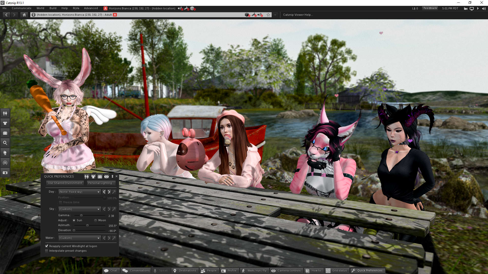
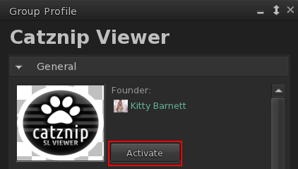
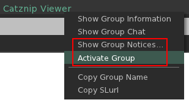
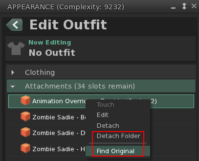
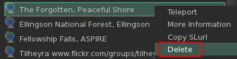
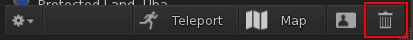

# Catznip R13.1

As promised with the release of R13 we want to bring you a maintenance release every few months with critical bugfixes and some (frequently) requested improvements.

Work on R14 - which will bring Catznip closer to LL's latest shiny - is progressing nicely and I expect to have the first beta ready to go in a couple of weeks, so do keep an eye on the Catznip group's notices.

We're also happy to see more people start to make use of our Discord server! If you use Discord, please consider joining us there. We're not always online in SL to answer questions you might have, but we'll answer everything that comes up there whenever we do see it.

## Multi-Factor Authentication (MFA)

R13.1 includes viewer support for multi-factor authentication, which is an (entirely optional) way to keep your account more secure.

Inara Pey has a great write-up - with screenshots - over at her blog which you should definitely read if you would like to learn more, or if you're just wondering how to enable it @ [Second Life Multi-Factor Authentication: The What and How](https://modemworld.me/2021/09/22/second-life-multi-factor-authentication-the-what-and-how/).

Or head over to the official knowledge base article @ [Password and account information](https://community.secondlife.com/knowledgebase/english/password-and-account-information-r2/#Section__5_1).

## Mouselook improvements

There's a lot we want to do to improve the default mouselook experience, but here are a few improvements that were requested through feedback to start us off:

* allow script dialogs while in mouselook
* don't immediately snap the mouse back to the centre of the screen after a (scripted touch) click
* show the hand cursor while holding down ++ctrl++ in mouselook to indicate touchable faces

## Group activation

Frequently an event will offer a perk for having its group active, or a shop will have exclusive gifts for members of the store group. Usually a group SLurl will be present in chat giving you quick access to the group profile, but if you're already a member you have to open the people floater, click on the group tab, find the group and then finally right-click it to pick 'Activate'.

* The group profile will now feature an 'Activate' button (if you're already a member of the group)
* Right-clicking a group SLurl in chat now has a new 'Activate Group' option

(Additionally, I've also added a 'Show Group Notices' item for added convenience)

## Minor improvements

### Chat tab navigation

Catznip already had a keyboard shortcut to switch between chat tabs, but a user suggested adding an additional shortcut to easily switch between chat tabs with unread messages, so we did!

The shortcuts differ depending on whether you're using horizontal or vertical chat tabs; the following table gives you an easy overview:

| Shortcut            | Action                                                            |
| -------------       | -------------------------------------------------                 |
| ++alt+left++        | [Horizontal] Switch to the previous chat tab                      |
| ++alt+right++       | [Horizontal] Switch to the next chat tab                          |
| ++alt+shift+left++  | [Horizontal] Switch to the previous chat tab with unread messages |
| ++alt+shift+right++ | [Horizontal] Switch to the next chat tab with unread messages     |
| ++alt+up++          | [Vertical] Switch to the previous chat tab                        |
| ++alt+down++        | [Vertical] Switch to the next chat tab                            |
| ++alt+shift+up++    | [Vertical] Switch to the previous chat tab with unread messages   |
| ++alt+shift+down++  | [Vertical] Switch to the next chat tab with unread messages       |

### Edit Outfit context menu

We received a feedback item that 'Edit Outfit' items were missing some context menu options that are available in the 'Wearing' tab, so we added those in.

### Teleport history pruning

It seems that some of our users run a secret society and would like a way to remove their secret HQ from their teleport history without clearing it entirely so in exchange for an invitation we've added both a 'Delete' option when right-clicking a teleport history item as well as a trash button on the toolbar.

PS: If you're reading this, we still haven't received our invitation!

## Bugfixes

* CATZ-617: Scripts in inventory don't save as Mono when SaveScriptsAsMono is set
* CATZ-626: Searching Preferences sometimes results in unclickable tabs
* CATZ-627: Controls hang past the bottom of the beacons floater
* CATZ-630: Unable to click on preferences tabs after searching for a keyword
* CATZ-639: Can't drop a sound from inventory onto the 'Chat Alert' floater's controls

## RLVa

### Improvements

* CATZ-633: Allow separate customization of the blocked teleport offer and the blocked teleport request response

### Bugfixes

* CATZ-638: The nearby participant list should be anonymized when @shownames restricted
* CATZ-638: The nearby participant list should be unavailable when @shownearby restricted

--8<-- "includes/abbreviations.md"
