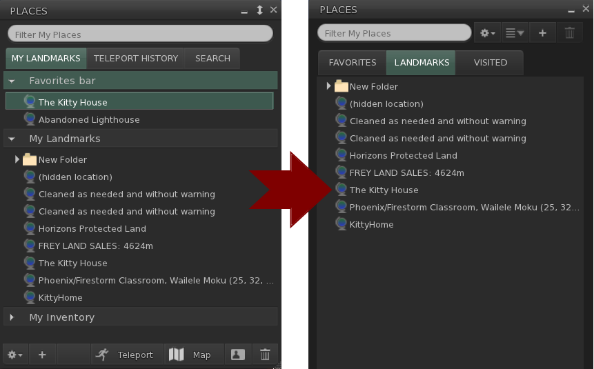
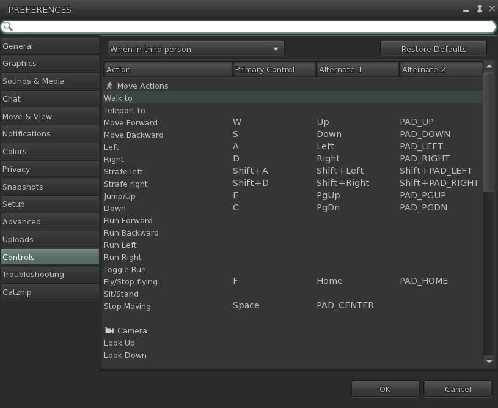

# Catznip R14  (Beta)

This release is the first step in catching Catznip up with more recent Linden Lab viewer releases.

!!! warning "Known Issues"

    Due to the high number of Linden Lab releases that were merged into R14 we'd like to take a different approach in beta testing.
	We are aware that the initial betas won't be as polished as they usually are; however this gives you a chance to uncover bugs we
	inherited from LL or run into changes that may have negatively impacted Catznip-specific features while we work on getting the 
	things listed below polished.
	
	We'll update this page with every beta release; **please report any odd behaviour because if it's not listed on this page then
	chances are that we don't know about it!**
	
	1. Places floater

		LL removed the 'My Inventory' landmarks tab from the places floater and split the 'Favorites' and 'My Landmarks' into their
		tab (among some other less obvious changes).
		We're not particularly fond of this change ourselves and (limited) initial feedback indicates that people liked it better so
		we will recreate the old look and feel before the R14 release).
		
		

	2. Custom keyboard bindings
	
		This LL feature finally made it into Catznip but we are not fond of its confusing UI at all so this will require a massive
		rework before the final R14 release.
		If you have any thoughts about the way this feature works (good or bad!) please do let us known since the rework is very much
		still in flux.
		
		
